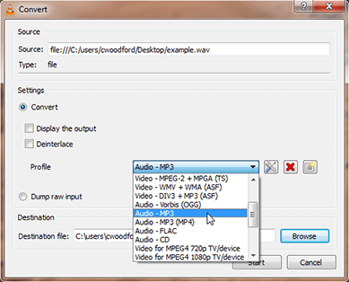

"I get an error that says: 'PowerPoint cannot insert an audio from the selected file. Verify that the necessary codec
for this media format is installed, and try again.' I've tried on two different computers, and I can't get the audio file
to play. Have you ever run into this before?"

Yes. I get this question all the time. It comes in various forms. How do I open this file in Audacity? Why can't Windows 
Media Player play this file? How come I can't play this recording I made on my phone on my desktop? In fact, the reason 
I'm writing this post because I hear this question so frequently that I want to have a resource I can point people 
to that will help explain what's going on.

It can be puzzling for sure. The problem: you have an audio file with an extension that's ubiquitous, though none of the
software you have can open the file, but you can open other files with the same extension. So what gives?

Knowing the difference between audio codecs and containers may help you resolve your issues.

<h4>What is an audio codec?</h4>

An audio codec is a process by which an audio file is compressed and decompressed. A codec specifies how audio data
should be encoded and decoded, which is what allows the data to be edited, saved, transferred and played on various
devices. Think of a codec as a key. When data is encoded, or changed from one format to another, a codec is used to lock
the data into a pattern; when data is decoded, like when you play an audio file, a codec is used to unlock the data and
describes the pattern in which it was stored so that it can be reconstituted.

<h4>What is an audio container?</h4>

If a codec is a key that locks up data, a container is the box in which data is stored. A container can also be called a
format. Whereas codecs are more mysterious in their presentation, a container can be recognized more easily by looking
at a file's extension. MP3, for example, is the file extension for the MPEG-1 Layer-3 audio container. (If you're
curious, the "MPEG" stands for Motion Picture Experts Group, the organization that maintains the standard; the "3"
refers to one of the sections of the standard that specifically covers audio encoding. Check out <a href="#tidbits">more
tidbits and talking points</a> at the bottom of this post!)

<h4>TL;DR</h4>

There are two key points to take away from what we've covered so far.

First, recognize that there are dozens, if not hundreds, of codec/container combinations possible. Just because your
media player can play one MP3 file doesn't mean it'll be able to play them all. The key is the codec. If your device
and/or software doesn't recognize the codec, you won't be able to unlock the data.

Second, recognize that the issue is environment dependent. An audio file that works in PowerPoint 2016 may not work in
PowerPoint 2010; an audio file that can be played on your Apple device may not play on your Windows device; an audio
file that opens on your personal computer may not open on your work computer, even if you use the same software.

<h4>So how do I resolve my issue?</h4>

For the technically inclined, the first step is to figure out what is the codec in question. I like to use
the <a title="FFmpeg Website" href="https://ffmpeg.org/" target="_blank" rel="noopener">FFmpeg</a> command
ffprobe (<code>$ ffprobe [options] [input_file]</code>). This will print out the codec for a file and from there you can
seek out the codec and install it on your device so the file can be manipulated. Or, if the codec is obscure and you
just need to get the file into a format you can hand over to someone else, you can use FFmpeg to transcode the file to a
more universal format. Have an audio file that won't play in PowerPoint? Easiest thing to do is to re-encode the file as
MP3, using a common codec to do the encoding. Windows Media Player won't open your file? Convert it to a WMA. Pulled a
CAF file from your phone? Convert it to an AAC.

For those not technically inclined, I have two software recommendations and a pro tip.

For audio playback, check out
the <a title="VLC Website" href="http://www.videolan.org/vlc/index.html" target="_blank" rel="noopener">VLC media
player</a> (free). In my experience there have been very few files VLC hasn't been able to play right out the box. For
audio editing or re-encoding, check
out <a title="Audacity Website" href="http://www.audacityteam.org/" target="_blank" rel="noopener">Audacity</a> (also
free). Again, it opens most files I've thrown at it without a problem. And those that it did have a problem opening, it
provided pretty detailed error messaging, which made resolving the issue easier.

The pro tip addresses re-encoding files so they work with other software. Let's say you have a MP3 file that you can
open in VLC but for some reason can't embed in PowerPoint. In VLC, click File &gt; Convert/Stream... and a dialogue box
should open that will walk you through re-encoding a file. Many media players have a feature that enables you to "save"
or "export" or "convert" a file from one format to another, including iTunes, Windows Media Player and VLC.

It's relatively the same thing you can do with FFmpeg and Audacity, usually just with less precision or with fewer 
options. And it's not uncommon to re-encode a file to the same type of file, e.g. re-encode a MP3 file as a MP3 file. 
This is often the quickest way to fix encoding errors that occurred in the original file and/or ensure your file is 
using a universally recognized codec. Just select the MP3 "profile" in your converter software and let it handle the 
rest of the details.

Of course, this is all assuming you aren't working with a file that someone simply renamed from a WAV to a MP3. If
that's the case, good luck, you've got a much bigger problem to deal with.

<h4 id="tidbits">Tidbits and Talking Points</h4>

Need a conversational icebreaker or something to wow the crowd? Try one of these.

Codec stands for <b>co</b>der/<b>dec</b>oder.

The degree of compression that happens during encoding affects audio quality and file size among other things. Encoding
is generally categorized as either uncompressed or compressed, and if compressed, either lossless or lossy. A WAV file
is an example of uncompressed audio. A FLAC file is an example of lossless compressed audio. A MP3 file is an example of
lossy compressed audio.

WAV files are limited in size to 4 gigabytes, whereas, CAF files use 64-bit file offsets, eliminating practical limits.
A standard CAF file can hold audio data with a playback duration of hundreds of years.

Typically, encoding goes from an uncompressed, raw source file format to a compressed format. Converting files in the
other direction, from compressed to uncompressed, doesn't improve audio quality. Encoding a compressed file to an
uncompressed or lossless format cannot replace data that is non-existent, and it's the data in an audio file that
determines the quality of the sound. At best, the file will maintain its quality. But more likely, the audio will
degrade a little each time it is re-encoded.

Technically, encoding audio means going from analog to digital. The conversion of one digital audio format to a
different digital audio format is called transcoding. However, today the two words are used mostly synonymously.

Still looking for more? Here are the most common links I share with people when helping them work through multimedia
processing issues:

<ul>
 	<li><a title="Video and audio file formats supported in PowerPoint" href="https://support.office.com/en-us/article/Video-and-audio-file-formats-supported-in-PowerPoint-d8b12450-26db-4c7b-a5c1-593d3418fb59" target="_blank" rel="noopener">Video and audio file formats supported in PowerPoint</a></li>
 	<li><a title="List of codecs" href="https://en.wikipedia.org/wiki/List_of_codecs" target="_blank" rel="noopener">List of codecs</a></li>
 	<li><a title="FFmpeg Codecs Documentation" href="http://ffmpeg.org/ffmpeg-codecs.html" target="_blank" rel="noopener">FFmpeg Codecs Documentation</a></li>
 	<li><a title="Audacity Manual" href="http://manual.audacityteam.org/" target="_blank" rel="noopener">Audacity Manual</a></li>
 	<li><a title="Formats Supported by VLC" href="https://wiki.videolan.org/VLC_Features_Formats/" target="_blank" rel="noopener">Formats Supported by VLC</a></li>
 	<li><a title="ffprobe Documentation" href="https://www.ffmpeg.org/ffprobe.html" target="_blank" rel="noopener">ffprobe Documentation</a></li>
 	<li><a title="Comparison of audio coding formats" href="https://en.wikipedia.org/wiki/Comparison_of_audio_coding_formats" target="_blank" rel="noopener">Comparison of audio coding formats</a></li>
</ul>