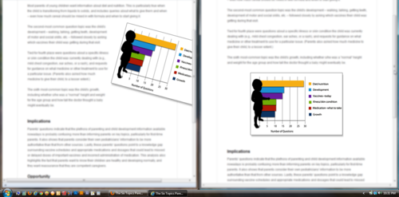

Today's goal was to create a page layout where an image would display tilted and nudged off the page in browsers that
render rotate transformation CSS, but would also display nicely in those that don't (IE). This was accomplished by using
conditional statements.

I'm at the same time proud and a little ashamed of this hack.

Regardless, I'll share my method: using a combination of the following conditionals I was able to create two versions of
this page that displayed differently depending on which browser the user viewed the page with.

<pre class="rounded-4 mb-3"><code class="language-clike">&lt;!--[if !IE]&gt;&lt;![IGNORE[--&gt;&lt;![IGNORE[]]&gt;
    /* HTML instructions for non-IE here */
&lt;!--&lt;![endif]--&gt;

&lt;!--[if IE]&gt;
    /* HTML instructions for IE here */
&lt;![endif]--&gt;
</code></pre>

Basically, I gave the image a class of <code>.tiltedImage</code> and styled it in the CSS, placed
it where I wanted it and told IE to ignore it. Then, in a more IE-friendly spot on the page, I called the image again,
this time without giving it the <code>.tiltedImage</code> class and specifying the image to render
only if the browser was IE. Final page looks like this (non-IE browser display on left, IE on right):

Not the most graceful form of degradation, I'm sure. But it got the job done.

    The legend himself, <a class="alert-link" href="http://aaron-gustafson.com/" target="_blank" rel="noopener">Aaron Gustafson</a>, 
    points out this example is 
    <a class="alert-link" href="https://twitter.com/AaronGustafson/status/139978166117740544" target="_blank" rel="noopener">more 
    progressive enhancement than graceful degradation</a>. I feel blessed.

