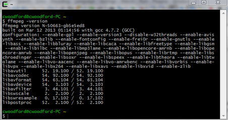

If you edit audio and video on a regular basis and don't already
use <a href="http://www.ffmpeg.org/" target="_blank" rel="noopener">FFmpeg</a>, prepare to have your mind blown.

It really is an amazing tool. In fact, I can barely remember life before I started using FFmpeg. I vaguely remember 
opening audio and video files, one by one, in something like Sony Sound Forge or Adobe Premier Pro, making an edit and 
then re-saving/re-encoding the file. Since I started using FFmpeg, editing multimedia files from the command line, I've 
started saving a ton of time—time lost in the past to simply opening, loading, decoding and encoding files. FFmpeg isn't 
the perfect editing tool for every occasion. But if you find yourself repeatedly making the same edits to one file after 
another, using software like Sound Forge, Soundbooth, Vegas Pro, Premier Pro, or whatever else, there's a good chance 
FFmpeg can greatly increase your productivity.

So what exactly is FFmpeg? It is a command line tool you can use to edit a variety of multimedia files and formats. From
ffmpeg.org:

<figure class="bg-light p-3 rounded border">
  <blockquote class="blockquote fst-italic mb-0">
    

        FFmpeg is the leading multimedia framework, able to decode, encode, transcode, mux, demux, stream, filter and 
        play pretty much anything that humans and machines have created. It supports the most obscure ancient formats 
        up to the cutting edge.
    

  </blockquote>
</figure>

The following five commands are ones that I use on a daily basis. I'll briefly explain what each command does and how I 
put it to use.

The commands in this article assume that FFmpeg has already been added to your
path (<a href="http://www.wikihow.com/Install-FFmpeg-on-Windows" target="_blank" rel="noopener">learn how to do that
here</a>). They also assume that your working directory is the one in which all of the files you want to edit reside.

<h4>Ripping Audio From Multiple Videos</h4>

<pre class="rounded-4 mb-3"><code class="language-java">$ for i in *.wmv; do f=${i%%.*}; ffmpeg -i ${f}.wmv -qscale 0 -vn ${f}.mp3; done</code></pre>

The command above will rip audio from each video in a directory and output each video's audio into a separate MP3. It
translates to: for each WMV file in the directory I'm currently in, use FFmpeg to convert the video into an MP3 that has
the highest audio quality possible (-qscale) and disable the video from the conversion process (-vn).

Couple things to note here. One, qscale can range between 0 and 31, the lower the qscale the better the quality. Two, it
is a common mistake to use the sameq option, thinking that it refers to "same quality"; sameq actually stands for "same
quantizer". This option is removed from newer versions of FFmpeg due to the confusion and misuse it causes and the
limited number of cases in which it would ever make sense to actually use.

So how is this command helpful? Well, in my day-to-day, I receive tons of video files from clients who want their data
transcribed. Sure, we could send these huge video files out for transcription, but think of all the time that would be
wasted uploading and downloading files. In most cases, for transcription, the video is not necessary. So using the above
command to rip the audio from videos as a batch ultimately saves time on the back-end.

<h4>Trimming Video Files with No Re-rendering</h4>

<pre class="rounded-4 mb-3"><code class="language-java">$ ffmpeg.exe -i [INPUT] -acodec copy -vcodec copy -ss HH:MM:SS -t HH:MM:SS [OUTPUT]</code></pre>

The command above will output a trimmed video file without the hassle of having to re-render the file. If you've ever
edited video before, you know how time consuming re-rendering can be. For those unaware, most video editors will
re-encode each frame of a video after you edit it. Many times, this is unnecessary, especially if the only thing you're
editing is the length of a video. The command above translates to: use FFmpeg to take this input video file and copy the
audio codec (-acodec copy) and video codec (-vodec copy) from this starting point (-ss) for this length of time (-t) and
output the result.

Note, the t option should be thought of as duration. It is not a time-stamp. Also, this command assumes that the input
format is of the same format as the output format. If you require those to differ, additional options may need
specified.

This command is particularly helpful for making video clips. Or say you have one video you want to split into several
separate videos, like a video of a rock concert where you want all songs separated into their own file. With this
command you can quickly specify where in the video your clip starts, how long your clip is and get on with it. Using
traditional video editing software, you'd have to load the video file, delete the unwanted parts of the first clip,
re-encode the video, re-open the original video file, delete the unwanted parts of the second clip, re-render the video,
so on and so forth. If time is money, this command could be your nest egg.

<h4>Converting Multiple WAV Files to MP3</h4>

<pre class="rounded-4 mb-3"><code class="language-java">$ for i in *.wav; do ffmpeg -i ${i} -qscale 0 ${i}.mp3; done</code></pre>

This is a classic. Translates to: for each WAV file in the directory I'm currently in, use FFmpeg to convert each file
to a MP3 with the highest quality audio possible.

When editing audio, most sound files will be converted to WAV format upon load so no sound quality is lost during the
editing process. And some audio editing programs do a poor job of encoding audio to MP3—either it takes a long time to
do or it is done with poor accuracy. Sometimes it just makes more sense to save out all of your audio in WAV format and
use the above command to convert all of your files into MP3 in one batch after all editing is complete.

<h4>Converting Multiple WMA Files to MP3</h4>

<pre class="rounded-4 mb-3"><code class="language-java">$ for i in *.wma; do ffmpeg -i "$i" -acodec libmp3lame -ab 192k -ac 2 -ar 48000 "$(echo $f| head -c -5).mp3"; done</code></pre>

Working with Microsoft file formats can often lead to difficulties. Sure, Windows Media Player can convert WMA files to
MP3. But what if you don't have Windows Media Player available? Use the above command. Looks a bit intimidating, but
isn't really. In short, it translates to: for each WMA file in the directory I'm currently in, use FFmpeg to convert the
audio file to a MP3 file.

The acodec option (-acodec) tells the conversion process to use the Lame MP3 library for conversion; the ab option (-ab)
sets bitrate; the ac option (-ac) sets number of audio channels; the ar option (-ar) sets sampling rate; the rest sets
file name and meta data ("$(echo $f| head -c -5).mp3"). Also note, the MP3 Lame library (libmp3lame) is not, by default,
included in FFmpeg. To take advantage of the Lame library you need to compile FFmpeg from source with the library
included.

<h4>Muxing Audio with Video</h4>

<pre class="rounded-4 mb-3"><code class="language-java">$ ffmpeg -i [AUDIO INPUT] -i [VIDEO INPUT] -acodec copy -vcodec copy -map 0:0 -map 1:0 [VIDEO OUTPUT]</code></pre>

Muxing, or combining multiple signals into one, can be a tricky process. In example, say you have a video file that has
audio and you want to overwrite that video file's original audio with some other audio. You could use the command above
to do so. The translation is: using FFmpeg, take this audio file and this video file, copy their audio codec and video
codec, then overwrite (-map) the video's audio file with the new audio and output a new video file.

"Mapping" streams is a bit of an advanced technique. As simply put as possible, the first number of the "ratio" in a
mapping specifies which input file to pull an index from, and the second number specifies which index, or stream, from
the selected file to use. In the above command, we say combine the audio stream from the audio file (0:0) and the video
stream from the video file (1:0) into one output file. Note, we do not specify what to do with the audio stream from the
video file (1:1), which is why it would not be found in the output
file. <a href="http://ffmpeg.org/ffmpeg.html" target="_blank" rel="noopener">Refer to FFmpeg documentation for more
examples of how mapping works</a>. Learning how to map video and audio streams can be difficult, but also super useful.

I use it mostly when I need to edit the audio of a video, but do not need to edit the video itself. In example, say I
have a video where someone reveals identifiable information in it. Instead of editing the entire video and having to
re-encode the whole the thing, I can simply rip the audio from the video, silence the identifiable information, and mux
the edited audio back to the original video. This not only saves time in most cases, but also removes the steep learning
curve required by most professional video editing software when making simple edits to a video's audio track.

So there it is, the five FFmpeg commands I think everyone should know. If you don't use FFmpeg, and for some reason read
this entire post, I hope at least your interest has been piqued. FFmpeg is really a powerful tool. I'm nowhere near a
power-user, but even still FFmpeg has completely changed my workflow for the better. It not only saves me time, but also
eliminates many annoying headaches introduced by other, heavier a/v editing software—lost or corrupt data due to
software crashes or memory shortages, time spent encoding, decoding and rendering, learning and re-learning the GUIs,
tools and shortcut commands that differ from one software to the next, etc.

Have a FFmpeg command of your own that has saved your life at one point in time? I'd love to hear about it!