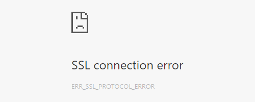

You're developing locally. Your war exploded. Your artifact deployed. Your browser pops open to localhost:8080. And
boom, sad face — Google Chrome displays an SSL connection error message.

The details read: "Unable to make a secure connection to the server. This may be a problem with the server, or it may 
be requiring a client authentication certificate that you don't have." You load localhost in Firefox, Edge, IE, Safari, 
and the page loads fine. What gives?

Before you start googling "client authentication certificate" or "localhost doesn't work on Chrome" or "chrome NET::
ERR_CERT_AUTHORITY_INVALID localhost" (like I did) take a look at the URL Chrome is trying to access. Is it HTTP or <em>
HTTPS</em>?

If you're like me, it will be HTTPS. And every time you try and load the non-secure, HTTP URL, Chrome re-directs you to
the secure, HTTPS URL. The problem might be your localhost isn't running on a secure version of the hyper text transfer
protocol. That's why when you type in http://localhost:8080 in Firefox or Edge or Safari your page loads fine. Those web
browsers aren't re-directing you. HTTP Strict Transport Security (HSTS) is an established standard for all major web
browsers, but as of now, at least for me, only Google Chrome has it enabled by default.

<b>So how do we get around this issue? To fix, try this: go to chrome://net-internals, select "HSTS" from the drop down,
enter localhost under "Delete domain" and press the Delete button.</b>

Note, this is a temporary fix. As soon as you visit localhost over HTTPS again it'll be included in this HSTS list again
and you'll start seeing that SSL connection error message again.

If you have an easy, permanent solution to this issue, I'd love to hear about it. I read about some fixes requiring
edits to web server conf files. But if you're lazy like me, or not really sure which line in which conf file should be
edited, try this solution first. I hope it saves someone out there a couple hours' worth of frustration troubleshooting
the issue.

For the record, I think "encryption by default" is a great thing and appreciate web browsers moving in that direction
with search queries and how content is loaded. But it can sure cause some puzzling issues when it comes to local web
development. I encourage you to learn more about
HSTS <a title="owasp.org article on HSTS" href="https://www.owasp.org/index.php/HTTP_Strict_Transport_Security" target="_blank" rel="noopener">
from owasp.org</a> or better
yet <a title="Chromium Projects" href="https://www.chromium.org/hsts" target="_blank" rel="noopener">from Google's
Chromium Projects site</a>.

I ran into this issue trying to run a Java web app on a computer I hadn't run it on for a while, a computer that I'd
just loaded Windows 10 on. I ran into a bunch of issues getting my dev environment back up and running, including having
to re-install Apache, services hogging the 8080 port, environment variables no longer matching their values, etc. Oh,
the joy! I'll definitely be posting more on how I worked through those issues in the future.