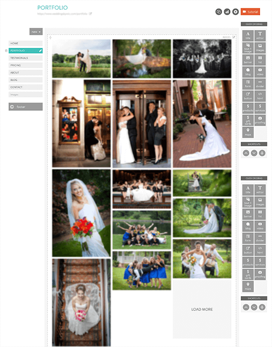
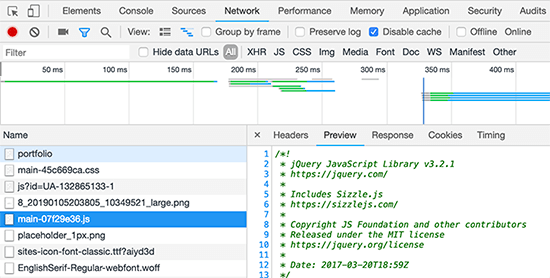
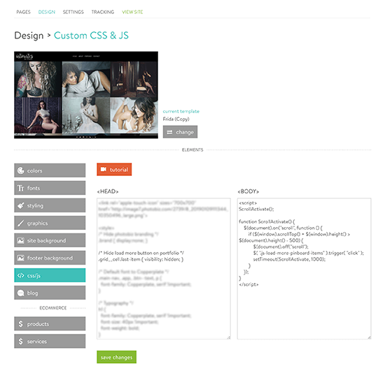

In this article, we'll walk through how to enhance the user experience of your PhotoBiz website by adding infinite
scrolling to a Pinboard page template.

<a href="https://photobiz.com/" target="_blank" rel="noopener noreferrer">PhotoBiz</a> is a popular website builder and
suite of tools designed specifically for photographers. Using PhotoBiz, it's quick and easy to build an online
presence—to blog, invoice customers, market services, etc.—with little to no maintenance involved.

Infinite scrolling is the technique where, instead of having visitors to your site click from one page to another to see
more content, more content is loaded continuously on the same page as your visitors scroll down the page, creating the
effect of having a page that goes on
forever. <a href="https://infinite-scroll.com/demo/masonry/" target="_blank" rel="noopener noreferrer">Here's an example
of infinite scrolling in action.</a> Infinite scrolling is a great technique to add to your site if you want to make
browsing a lot of images quick, easy and intuitive, especially if a lot of the people visiting your site are doing so
from mobile or touch-screen devices.

<h4>Exploration</h4>

When you create a page in PhotoBiz, you use a WYSIWYG (what you see is what you get, pronounced wiz-ee-wig) editor to
drag and drop elements like a title, a button or an image onto a page. After placing an element on a page, you can
further refine the content and styling of the element by selecting the Advanced option from the element's dropdown menu.
These elements form the building blocks of each page on your site. 

A common page template on a photography site is a Portfolio page. This page typically includes a large number of images
showcasing work. Let's say, for example, you have a Portfolio page on your PhotoBiz site that has one Images element on
the page, and that element contains a bunch of your best photography. It might look something like this in the WYSIWYG
editor:

By default, a couple images are shown on the page, along with a Load More link that, when clicked, will load another 
batch of images onto the same page. In this example, our Layout is called Pinboard, set to display 5 rows of images 
across 3 columns, with a Last Item Link with the text Load More. Note: while the infinite scrolling technique can be 
applied to any Images element layout, this article's code assumes the layout being used is Pinboard; tweaks to the code 
will be required if a different layout is used.

If we cracked open the Developer Console in Google Chrome, switched over to the Network tab and re-loaded the site, we'd
see something like this:

We see that PhotoBiz is loading one main stylesheet (the .css file) and one main JavaScript file (the .js file), along 
with other site assets, like fonts and images. Looking specifically at the main JavaScript file, we can see the first 
library loaded is <a href="https://jquery.com/" target="_blank" rel="noopener noreferrer">jQuery</a>. This is notable 
because it informs us on how we can write our custom JavaScript code to make the infinite scrolling work.

So we have our Portfolio page. It's built using an Images element. It's composed of a bunch of images displayed using
the Pinboard layout with a Load More link. We also know that PhotoBiz is packaging up our CSS and JS nicely so that the
site runs quickly, and that we have jQuery at our disposal. With our exploration complete, let's begin implementation.

<h4>Solution</h4>

Our goal is to make more images load onto the Portfolio page seamlessly as the user scrolls down the page, eliminating
the need for the user to click the Load More link. To achieve this goal, we really only need to do one thing:
programmatically load the next batch of images after the user scrolls a given amount. We can do this with JavaScript.
And to maintain the infinite scrolling illusion, we'll use CSS to hide the Load More link from view since our visitors
will no longer need to interact with it.

To add custom JavaScript and CSS to your page, navigate in your PhotoBiz Builder to the Design tab and click on the
CSS/JS button. The page you land on should look something like this:

CSS should go in the <code>&lt;HEAD&gt;</code> section of your page (top of page); JavaScript should go in the 
<code>&lt;BODY&gt;</code> section of your page (bottom of page). This is a web development best practice. Adding custom 
code to this section in PhotoBiz will load the code on all pages of your site. This means that any page that loads an 
Images element with a Pinboard layout will be affected by our custom code. There are ways to focus the code to specific 
elements on specific pages, but we won't get into that in this article. For now, we'll assume that every time we use an 
Images element, regardless of what page we put it on, we want the images to load automatically on scroll to create the 
infinite scrolling effect.

Let's start with adding the JavaScript. Here's the code that we should add to the <code>&lt;BODY&gt;</code> tag:

<pre class="rounded-4 mb-3"><code class="language-javascript">&lt;script&gt;
ScrollActivate();

function ScrollActivate() {
    $(document).on("scroll", function () {
        if ($(window).scrollTop() + $(window).height() &gt; $(document).height() - 500) {
            $(document).off("scroll");
            $( ".js-load-more-pinboard-items" ).trigger( "click" );
            setTimeout(ScrollActivate, 1000);
        }
    });
}
&lt;/script&gt;
</code></pre>

We write our JavaScript within a <code>&lt;script&gt;</code> tag, which tells the browser how to handle the code. We
have one function called <code>ScrollActivate</code>. This function says when a user scrolls down the page, if the
amount scrolled is greater than the document height minus 500 pixels, remove the scroll event handler, then trigger a
click event on the Load More link (which we target using the default classname "js-load-more-pinboard-items", which
PhotoBiz injects into the link element by default). This trigger will load the next batch of images. Then we say to
recall this function after 1000 milliseconds (1 second), which will set another scroll handler that will wait for the
user to scroll again before loading the next batch of images.

Next, let's hide the Load More link from the user's view. Here's the code that we should add to the <code>
&lt;HEAD&gt;</code> tag to do that:

<pre class="rounded-4 mb-3"><code class="language-css">&lt;style&gt;
.grid__cell.last-item { visibility: hidden; }
&lt;/style&gt;
</code></pre>

CSS code is written within a <code>&lt;style&gt;</code> tag, which tells the browser how to handle styling adjustments
to the page. We target the element we want to hide (the Load More link) through classnames like we did with
JavaScript (<code>.grid__cell.last-item</code>)—PhotoBiz adds the classnames "grid__cell" and "last-item" to the last
item in an Images element by default. And we use the visibility property to hide the element. <code>Visibility:
hidden;</code> tells the browser to hide the link from view but keep it in the DOM so our JavaScript can interact with
it, i.e. even though we don't see the link, it's still technically there.

Now, when we save and re-load our Portfolio page, we should no longer see a Load More link after the last image.
Instead, as we scroll down the page, new images should automatically load onto the page, creating an infinite scrolling
effect.

<h4>In Conclusion</h4>
Adding infinite scrolling to a page full of images can really add a nice, modern touch to the user experience. The user
can just keep scrolling and scrolling and scrolling to their heart's content with virtually no interruption. It can also
be a plus for site performance—instead of loading a ton of images at once, images are loaded on demand. And though
infinite scrolling is not an option available by default in PhotoBiz, it's a relatively easy feature to add to your
site.

You may need to play around with the "500" value in the JavaScript depending on your site's particular needs. (
Increasing this value will trigger the loading of the next batch of images sooner.) Likewise, if you use a layout other
than Pinboard, you may need to change the classname used in the JavaScript line <code>$(".js-load-more-pinboard-items").trigger("click");</code> 
because, as the classname suggests, it's specific to the Pinboard layout.

If you've found this article useful, I'd love to hear from you and check out your site. I'm also happy to lend a helping
hand to anyone struggling to get infinite scrolling working on their PhotoBiz site.