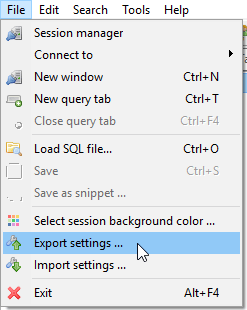

It happens to all of us. Maybe you trashed the sticky note you wrote the password on. Maybe someone on your dev team
changed the database connection credentials and forgot to tell you. Maybe it's been a while since you last connected to
the database, and now when you try to connect, for some unknown reason, it's not working. Whatever the case, there's
nothing worse than firing up HeidiSQL, receiving a connection error and not being able to tell if the stored password is
correct.

This has happened to me more times than I care to admit. In fact, that's why I'm writing this article. Recovering a
stored password from HeidiSQL is relatively easy, though not necessarily an intuitive process. So here's how to recover
a password stored in HeidiSQL in six simple steps.

<ol>
 	<li>Open HeidiSQL and select File &gt; Export Settings to dump settings into a text file. </li>
 	<li>Open the text file and search on the host name of the database you want to recover the password for.</li>
 	<li>A couple lines below the host name is the encoded password. It'll look something like: 755A5A585C3D8141. Keep this handy.</li>
 	<li>Copy the following code into a new document.

<pre class="rounded-4 mb-3"><code class="language-markup">&lt;!doctype html&gt;
&lt;html&gt;
&lt;body&gt;
&lt;script&gt;
function heidiDecode(hex) {
    var str = '';
    var shift = parseInt(hex.substr(-1));
    hex = hex.substr(0, hex.length - 1);
    for (var i = 0; i &lt; hex.length; i += 2) 
        str += String.fromCharCode(parseInt(hex.substr(i, 2), 16) - shift); 
    return str; 
} 
document.write(heidiDecode('[ENCODED_PASSWORD]')); &lt;/script&gt;
&lt;/body&gt;
&lt;/html&gt;
</code></pre>

</li>
 	<li>Copy and paste the encoded password from the HeidiSQL settings file into the heidiDecode function as the value to be passed as the hex argument, i.e. replace [ENCODED_PASSWORD] with your actual encoded password.</li>
 	<li>Save as a HTML document and run it in a web browser.</li>
</ol>

The text that displays on the web page is the decoded password stored in HeidiSQL. Simple!

Thanks to <a title="HeidiDecode.js" href="https://gist.github.com/jpatters/4553139" target="_blank" rel="noopener">
jpatters and his GitHub Gist</a>, which I always eventually stumble upon after spending way too much time googling for a
solution. Hopefully, this expanded explanation of that gist will help someone who's unfamiliar with exporting and
reading HeidiSQL data dumps, working with JavaScript, or who needs help filling in the gaps in the gist's directions.