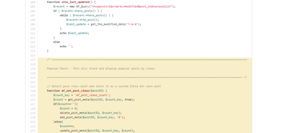
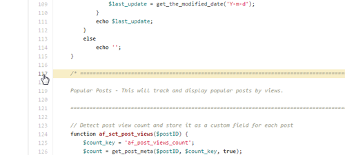

One of the features I use most often on GitHub is linking to highlighted lines of code in my repository.

<a title="GitHub" href="https://github.com/" target="_blank" rel="noopener">GitHub</a>, a Git repository web-based 
hosting service, is a great tool for source code management and version control. I use it for all of my web projects 
and even for management of files that are not necessarily website-related.

From time to time I like to share links to files in my GitHub repository. But instead of just sharing a vanilla URL, I
like to share a link that takes someone to a specific part of the page with a specific part of code highlighted.

This is very simple to do. On any GitHub page, click on a line number to the left of the code. Notice the URL is now
appended with the line number you selected (
e.g. <a href="https://github.com/chasewoodford/alertfocus.com/blob/master/wp-content/themes/starkers-master/functions.php#L117" target="_blank" rel="noopener">https://github.com/.../functions.php#L117</a>)
. Visiting this link will take you to the exact line of highlighted code.

To link to multiple lines of highlighted code, select your first line of code and then CTRL+SHIFT click (CMD+SHIFT for 
Mac) on the last line of code you want to highlight. Notice the URL is now appended with a range of line numbers (e.g. 
<a href="https://github.com/chasewoodford/alertfocus.com/blob/master/wp-content/themes/starkers-master/functions.php#L117-L148" target="_blank" rel="noopener">https://github.com/.../functions.php#L117-L148</a>)
. Visiting this link will take you to the beginning of the highlighted block of code.

One thing to keep in mind is that these links are not anchored to the code but to the line numbers. That means if you
make a change to the file's code the links may no longer highlight the lines of code you had originally intended to
highlight.

To link to the code, as opposed to line numbers, highlight the code you want to link to then click the "y" key. Notice
the URL changes again (
e.g. <a href="https://github.com/chasewoodford/alertfocus.com/blob/deffc216c5ac5ed6807289ca1fe8cf6f773e2447/wp-content/themes/starkers-master/functions.php#L117-L148" target="_blank" rel="noopener">https://github.com/.../blob/deffc216c5ac5ed6807289ca1fe8cf6f773e2447/.../functions.php#L117-L148</a>)
. You are now linking to lines of code stored in a unique version of the file's history. So now, even if the file is
altered in subsequent commits, your link will still point to the lines of code you originally intended to highlight.

There are lots of fantastic GitHub features like this. My second favorite feature is the File Finder, which you can open
by hitting the "t" key. And don't forget, you can always hit the "?" key on any GitHub page to open the Keyboard
Shortcuts window. There's also Owen Ou's
article <a title="10 Things You Didn't Know Git and GitHub Could Do" href="https://owenou.com/ten-things-you-didnt-know-git-and-github-could-do/" target="_blank" rel="noopener">"
Ten Things You Didn't Know Git And GitHub Could Do"</a> which is a good starting point for learning about other GitHub
tips and tricks.