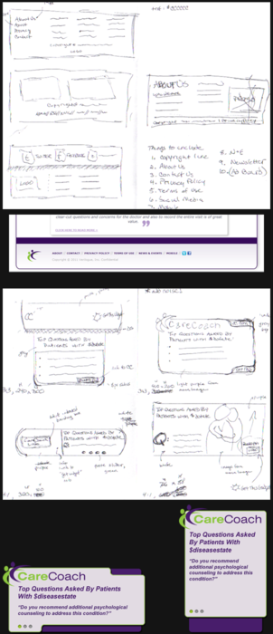

I love getting a behind-the-scenes look at others' creative process. Particularly, I love side-by-side comparisons of
creative ideas that make it to production. I find it incredibly interesting learning how others move from raw idea to 
something really beautiful.

Here is a glimpse into my creative process — two projects I worked on from conception to production for a service that
provides patients and caregivers with information, support and tools to improve their communications with their
healthcare providers called <a href="http://www.carecoach.com" target="_blank" rel="noopener">CareCoach</a> (retired).

The first project required creating a footer that was simple in design, modern-looking and offered flexibility for
future growth/additions. After some research — always one of the first steps in my creative process in which I digest as
much of other people's work as possible — I hand drafted some designs. Below that first sketch is where we ended up with
our initial production release.

The second project required creating a dynamic widget that would cycle through facts pulled from a database. This design
was a bit more challenging than the footer. Number one, it is hard to find widgets that others have created in a Google
search, let alone documentation on best practices. Two, making dynamic
data <a title="Responsive Web Design: What It Is and How To Use It" href="http://coding.smashingmagazine.com/2011/01/12/guidelines-for-responsive-web-design/">
responsive</a>. I'm not completely satisfied with where we ended up at time of production, however, we did make it a
long way from the original idea in very little time, and it was a great team effort.

I love the experience of seeing a project through from conception to production; the chance to work with others working
through their own creative process in their own respect; the reward of your idea getting to see the light of day.