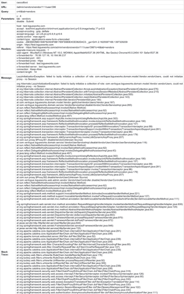
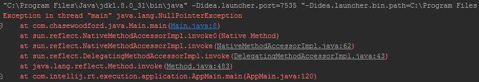
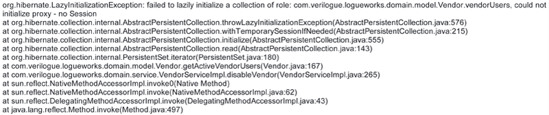

Chances are, even as a front-end developer, you'll stumble upon runtime exceptions at some point if you do any amount of
work in Java. You may not be obligated to fix these back-end issues, but having a general understanding of what they are
and how to read them is key to being able to maintain effective communication with your internal team and external
users.

Before we get too far along, I should make clear that I'm a front-end guy. I live and love HTML, CSS and JavaScript.
I've only recently begun to work more on the back-end. The following may be somewhat inaccurate. It's an honest
description of Java runtime exceptions from a front-end developer's perspective. I welcome all corrections and
critiques.

<h4>Understanding What Runtime Exceptions Are</h4>

First, it's important to understand what a Java runtime exception is. A runtime exception is an error that occurs at
runtime, or while it's in use. A runtime exception is an unchecked exception. (Exceptions in Java can be categorized
into one of two categories: checked or unchecked.) An unchecked exception is typically fatal, meaning your web app will
stop working once the error is run into.

In my experience, runtime exceptions always occur when a user does something you'd never expect them to do — as users
do. Runtime exceptions usually require immediate attention. It signals an error a user is running into that is making it
impossible for them to do what they're trying to do.

So what does a runtime exception look like? If you're a front-end developer like me, it's likely you'll run into your 
first exception in the form of an email notification received after running into an error on your test environment that 
caused your app to stop working. And it could quite possibly be the most intimidating email you've ever received. Here's 
an example of what an exception email looks like coming from an enterprise web application I work on. (Don't bother 
trying to read it. The point is it's really, really long and looks really, really confusing to someone who doesn't work 
on the back-end.)

<h4>How to Read Runtime Exceptions</h4>

We'll take a closer look at that email later. First, let's dissect a simpler example. The following Java code throws a
runtime error called a <code>NullPointerException</code>.

<pre class="rounded-4 mb-3"><code class="language-java">package com.chasewoodford.java;

public class Main {

     public static void main(String[] args) {

          String example = null;
          char[] toArray = example.toCharArray();
          System.out.println(toArray.length);

     }
}
</code></pre>

Walking through this code, we have a <code>Main</code> class with one method called <code>main</code>. The <code>
main</code> method sets a variable — a string called <code>example</code> — immediately to <code>null</code>. The method
then sets a second variable — a char type variable called <code>toArray</code> — equal to the character array of the
first variable <code>example</code>. The final line of the method attempts to print the number of characters of the
second variable <code>toArray</code>.

When we attempt to run this code the following exception is thrown in our console.

A <code>NullPointerException</code> is thrown because it's not possible to convert a null value to a character array. 
Our app dies before it even gets to the print line statement.

Now let's take a closer look at the exception itself. Generally, you should read exceptions from the top down. The first
line will tell you what type of exception was thrown. In this case it's a <code>NullPointerException</code>, which is a
type of runtime exception.

<pre class="rounded-4 mb-3"><code class="language-java">Exception in thread "main" java.lang.NullPointerException</code></pre>

From there, continue down until you see a line that looks like it references your specific application. In this case
it's the second line that references our <code>Main.java</code> file.

<pre class="rounded-4 mb-3"><code class="language-java">at com.chasewoodford.java.Main.main(Main.java:8)</code></pre>

Breaking this line into smaller pieces, we see the name of the package where the error occurred, <code>
com.chasewoodford.java</code>, the name of the class where the error occurred, <code>Main</code>, and the name of the
method where the error occurred, <code>main</code>, followed by the file name and line number where the error occurred
in parentheses, <code>(Main.java:8)</code>.

Now we know where to look in our repository to find the code causing the error. And even though we may not know how to
fix the code, we at least have a better idea of why the error is occurring and can confidently communicate the issue
with others.

Note, one of the nice features of most modern integrated development environments, like IntelliJ here, is that the
exception displayed in the console will provide a link directly to the line of code that caused the error. In other
cases, like when the exception is received via email, I've found the easiest way to navigate to the line of code causing
the error is to do a search on the method, class or file name.

Let's go back to that intimidating exception email and take a closer look at it now that we know the basics of how to
read an exception.

On the first line we see that the exception is a <code>LazyInitializationException</code>, which is a particular type 
of runtime exception thrown by the Java framework being used, called <a href="http://hibernate.org/">Hibernate</a>. 
Looking at Line 7 we see the first reference to our specific application. From that line we now know that an error 
occurred on <code>Vendor.java</code> at Line 167, which can be found in the <code>getActiveVendorUsers</code> method in 
the <code>Vendor</code> class. We know we can find the <code>Vendor.java</code> file in the <code>model</code> 
directory, inside the <code>domain</code> directory, inside the <code>com.verilogue.logueworks</code> package.

So what about all the other text in the exception? I think it's there just for intimidation. In my experience, if I
can't figure out the cause of the exception in the first couple lines of
the <a href="https://en.wikipedia.org/wiki/Stack_trace">stack trace</a> (that's what all that text in the exception
notice is called) I'll scroll towards the bottom and look for a line that starts with something like "Caused by" or a
line that doesn't start with the word "at". I think when you get to this point you're looking
at <a href="https://en.wikipedia.org/wiki/Stack_trace">nested exceptions</a>. Don't quote me on that though. I still
have a lot to learn about Java exceptions.

But I definitely felt like I leveled up when, instead of asking the back-end guys on my team to look into the bug I
found (and possibly created), I was able to read and understand the exception, find the code that was causing it and fix
the issue all on my own. It's an empowering feeling. It gave me confidence to experiment with new ideas, where I may not
have otherwise, because I knew that if I broke something I'd be able to figure out what I broke and how to fix it
without having to bother anyone else for help.

Of course, the number of different exceptions you may run into is plentiful. To this day I receive exception emails
whose meaning I can hardly understand. However, with the limited knowledge I <em>do</em> have of what exceptions are and
how to read them, I'm usually able to at least tell how critical the issue is, where the issue is occurring, whether or
not I did something to cause it, and who I need to follow up with, if anyone, to make sure the issue gets resolved.
Hopefully having read this article now you can, too.