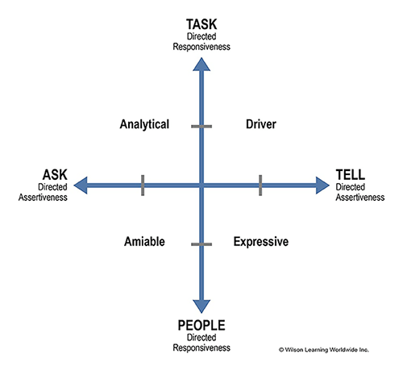
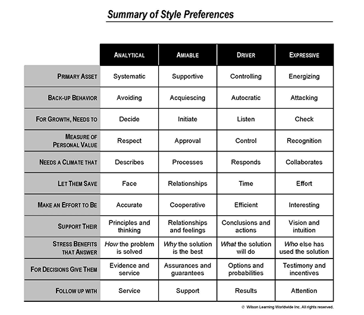

If you work with people and/or manage people that you find difficult to deal with, keep reading. This post reviews the
concept of Social Styles and how to leverage them for improved communication and collaboration in a team work
environment.

A couple weeks ago I went to a leadership development training hosted
by <a title="Wilson Learning: Social Styles at Work" href="http://wilsonlearning.com/wlw/products/brv" target="_blank" rel="noopener noreferrer">
Wilson Learning</a> called Leadership Foundations II. It's part of a series of
programs <a title="Publicis Health" href="https://publicishealth.com/" target="_blank" rel="noopener noreferrer">
Publicis Health</a> makes available to its employees to help them develop leadership
skills. The goal of the training is to provide managers with tools and techniques that help them lead teams more
effectively and achieve greater productivity. Of all the things I learned in this two-day workshop, the most valuable
was the concept of "Social Styles"—what they are, how they differ from person to person, how to recognize them and how
to modify behaviors to communicate more effectively with others.

So what exactly are we talking about when we talk about Social Styles?

<figure class="bg-light p-3 rounded border">
  <blockquote class="blockquote fst-italic">
    

        "Social style" is the behavior that one exhibits when interacting with others. Being aware of your own social
        style helps a person develop relationships, particularly at work. "Social Styles" is the name of a particular 
        psychometric instrument that helps people to better understand and work with others through appreciation of 
        their basic decision making and control needs.
    

  </blockquote>
  <figcaption class="blockquote-footer mt-2 mb-0">
    <cite><a href="http://psychology.wikia.com/wiki/Social_style" target="_blank" rel="noopener noreferrer">Wikia - Psychology Wiki</a></cite>
  </figcaption>
</figure>

In short, everyone can be categorized into one of four Social Styles buckets: <b>Driving</b>, <b>Expressive</b>, <b>
Amiable</b> or <b>Analytical</b>. And it's pretty easy to figure out what bucket you, or anyone else, fall into by
asking the following questions:

<ul>
 	<li>Is the person more task oriented or more people oriented?</li>
 	<li>Does the person tend to ask more questions or tell others what to do?</li>
</ul>

Answering those questions, and charting the answers on the graph below, is how you identify a person's Social Style.

Here's a quick definition of each Social Style:

<ul>
 	<li><b>Driving</b>: strong willed and more emotionally controlled</li>
 	<li><b>Expressive</b>: outgoing and more dramatic</li>
 	<li><b>Amiable</b>: easy going and more supportive</li>
 	<li><b>Analytical</b>: serious and more exacting</li>
</ul>

Take a second and think about what bucket you fall into. (I'm a Driver.)

At the leadership development training I attended, we all were tasked with figuring out our personal Social Style. The
results were interesting to see. Most of the Managers were Drivers; the Creatives were Expressives; the people with
Human Resource like jobs were Amiables; the developers, programmers and finance people were Analyticals. Makes sense
when you take a step back and think about it.

We were then asked to think about the people we considered difficult to work with. Using the following chart, which
summarizes each Social Style's strengths and weaknesses, we were asked to come up with ways to improve our relationships
with these people.

To improve a relationship with someone else, according to the Social Styles model, you need to do two things: 
recognize the other person's Social Style and then modify your Social Style in a way that enables reaching a mutual 
goal efficiently.

Recognizing someone else's Social Style is relatively easy. Plot them on the Social Style matrix. Or, if you're in the
midst of communicating with someone and haven't pinpointed their Social Style yet, keep an eye out for what's called
a <b>Back-up Behavior</b>. A person will exhibit their Back-up Behavior when they feel attacked or not an equal part in
collaboration. Analytical people will avoid confrontations; Amiable people will give in; Drivers will take over;
Expressive people attack or get defensive. If you notice this behavior, that's when you need to realize it's time to
modify your behavior.

When modifying your behavior, look at the chart above, find the column for the Social Style of the person you're
engaging with and find the corresponding "Make Effort To Be" and "Support Their" rows. This is how you should consider
modifying your behavior.

For instance, say you're working on a project with me (a Driver) and you thought I was taking it too much into my own
hands, not being a team player and not on the right course.

The thing you would not want to do is stop by my desk for a 15-minute chat about your feelings. I don't care. I'll
likely drop subtle hints about my disinterest in our conversation until you catch my drift and leave. Now we're both
angered by the interaction, our relationship hasn't improved and we've both wasted time with no positive results.

But, taking my Driver Social Style into consideration, you'd realize there is a better way to engage me—request a brief
meeting, outlining exactly what you want to discuss; support my conclusions and actions so far; in an effort to get the
project back on course, provide options for alternative ways we should proceed, noting outcome probabilities for each.
In essence, you're catering to my Social Style, persuading me to see things your way by making your argument in a way
that I can most easily digest.

Say you were an Amiable person, a people person, someone who likes to get everyone on board with their ideas—taking such
a cold, direct approach to an interaction might feel out of character. But by modifying your Social Style, our
interaction would be more likely to have a positive outcome.

Understanding the Social Styles model is easy, but applying it in real world situations is difficult. It's something you
have to actively work on incorporating into your communication style. It's not intuitive to recognize someone's Social
Style and immediately know how to cater to it. But there are things you can do to make implementation of the model
easier.

What I did was list out all the people I work with and plot their Social Style. This took maybe 15 minutes to do. Then,
I spent some extra time thinking about those people who I felt were difficult to work with and considered how my failure
to recognize their Social Style was contributing to the difficulties in our communication. Completing this exercise made
it obvious rather quickly that I was as much to blame for our troubled working relationships as they were. Now, when I
engage with these people in the future, I already know where they're coming from—what their motivations are, what
assurances they need, how to make them feel valuable, because I've already done that prep work—and can focus on
seemlessly modifying my behavior in a way that promotes a more productive working environment and achieves a common goal
more efficiently.

The leadership training I went to was mostly about how to "manage down" or manage those who report to you. But I find
having an understanding of Social Styles helps me also "manage up" or get what I want from my bosses, as well as improve
my relationships with peers, in general.

There are countless leadership development courses out there. Tons of tools and techniques to learn. But if you ever see
a session that specifically lists Social Styles in the curriculum, I encourage you to attend.