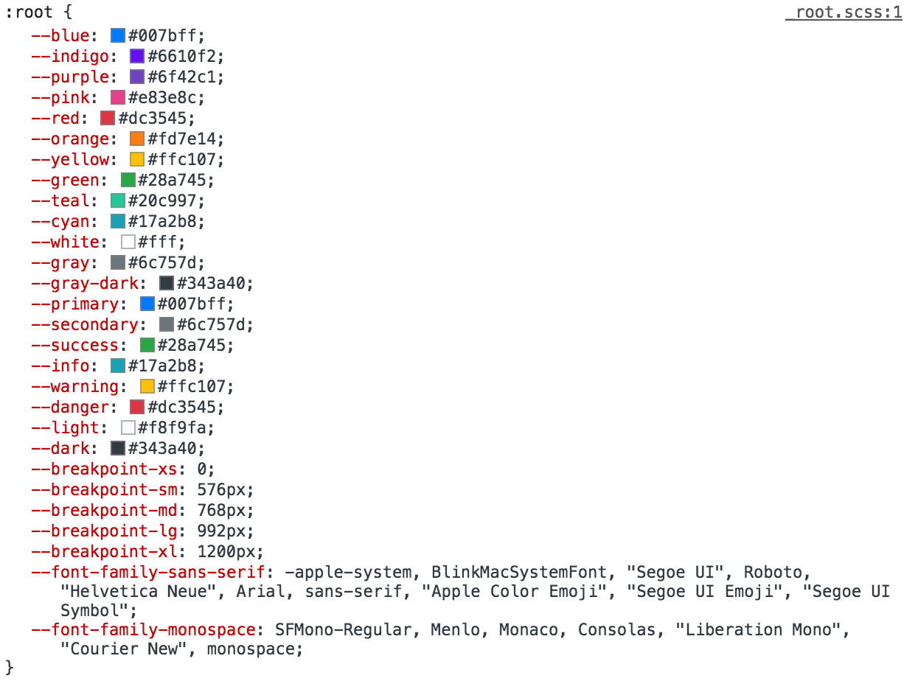

I'm leading the front end design on a project where we
use <a href="https://developers.google.com/chart/" target="_blank" rel="noopener">Google Charts</a>
to visualize data for a Java web application. The web app's front end is built
on <a href="https://getbootstrap.com/docs/4.6/getting-started/introduction/" target="_blank" rel="noopener">Bootstrap
4</a>. Anyone familiar with Bootstrap and <a href="https://material.io/" target="_blank" rel="noopener">Material
Design</a> (Google's design language) will immediately recognize the disparities between the two in terms of look and
feel. One challenge that presented itself while integrating Google Charts with the Bootstrap framework was how to keep
the colors in sync between the two systems. In this post, I'll cover how I worked Bootstrap 4 theme colors into Google
Charts via JavaScript to create integrated-looking data visualizations.

<h4>Setting the Stage</h4>

Admittedly, I'm a Bootstrap fan boy. I started with Bootstrap 3 and have followed development of Bootstrap 4 from its
inception. I'm active on <a href="https://getbootstrap.slack.com/" target="_blank" rel="noopener">Bootstrap's Slack
channel</a>. I think the Bootstrap community is fantastic. I think the Bootstrap 4 framework itself is wonderfully
designed. I find it very easy to work with, customize, extend. I've also worked
with <a href="http://sass-lang.com/" target="_blank" rel="noopener">Sass</a> for a number of years, and appreciate its
core integration in Bootstrap 4. I'm not so strong with JavaScript, but understand it's growing popularity. I'm also not
a Google Charts expert. I work with it because it's the library chosen by our backend developers to display data. With
all this in mind, the following should be taken with a grain of salt. And keep in mind, this is but one way out of many
to achieve the desired result.

<h4>Exploration</h4>

Looking at the <a href="https://github.com/twbs/bootstrap/blob/v4-dev/scss/_root.scss" target="_blank" rel="noopener">_
root.scss partial in Bootstrap's scss directory</a>, we find color, theme color, breakpoint and font variables added to
the <a href="https://developer.mozilla.org/en-US/docs/Web/CSS/:root" target="_blank" rel="noopener">:root pseudo
class</a> as <a href="https://developer.mozilla.org/en-US/docs/Web/CSS/--*" target="_blank" rel="noopener">custom
properties</a>. This is what the Sass code looks like:

<pre class="rounded-4 mb-3"><code class="language-scss">:root {
  ...

  @each $color, $value in $theme-colors {
    --#{$color}: #{$value};
  }

  ...
}
</code></pre>

And the <a href="https://github.com/twbs/bootstrap/blob/v4-dev/dist/css/bootstrap.css" target="_blank" rel="noopener">
CSS output</a> looks like this:

<pre class="rounded-4 mb-3"><code class="language-css">:root {
  --blue: #007bff;
  --indigo: #6610f2;
  --purple: #6f42c1;

  ...

  --primary: #007bff;
  --secondary: #6c757d;
  --success: #28a745;

  ...
}
</code></pre>

Looking at the CSS from the developer console in a web browser, we see something like this:

<a href="https://developer.mozilla.org/en-US/docs/Web/CSS/--*#Browser_compatibility" target="_blank" rel="noopener">
Browser support for custom properties is pretty solid</a>, aside from IE, meaning these variables are accessible on most
modern browsers.

And since Bootstrap includes these values on the <code>:root</code> pseudo element, which is essentially the same as
the <code>&lt;html&gt;</code> element, it means these values will be accessible on every page that loads the Bootstrap
CSS.

Now let's look at the Google Charts library. At a high level, to display a chart you have to do the following:

<ul class="square">
 	<li>Load a Google Charts package</li>
 	<li>Provide data</li>
 	<li>Specify options</li>
 	<li>Set a location for display</li>
 	<li>Draw the chart</li>
</ul>

Here's an example of what the JavaScript code might look like:

<pre class="rounded-4 mb-3"><code class="language-javascript">google.charts.load("current", { packages: ["corechart"] });
google.charts.setOnLoadCallback(drawChart);

function drawChart() {
    var data = google.visualization.arrayToDataTable([
        ["Item", "Amount"],
        ["Give You Up", 27],
        ["Make You Cry", 7],
        ["Run Around and Desert You", 8],
        ["Make You Cry", 15],
        ["Say Goodbye", 20],
        ["Tell a Lie and Hurt You", 23]
    ]);

	var style = window.getComputedStyle(document.documentElement),
		item1 = style.getPropertyValue('--red').trim(),
		item2 = style.getPropertyValue('--orange').trim(),
		item3 = style.getPropertyValue('--yellow').trim(),
		item4 = style.getPropertyValue('--green').trim(),
		item5 = style.getPropertyValue('--blue').trim(),
		item6 = style.getPropertyValue('--purple').trim();

	var options = {
		width: $(window).width(),
                height: $(window).height(),
		title: "Rick Astley Would Never",
		titleTextStyle: {
			color: item1,
			fontSize: 50,
			bold: true
		},
		pieHole: 0.2,
		pieStartAngle: 0,
		pieSliceText: "none",
		slices: {
			0: { color: item1 },
			1: { color: item2 },
			2: { color: item3 },
			3: { color: item4 },
			4: { color: item5 },
			5: { color: item6 }
		}
	};

	var chart = new google.visualization.PieChart(
		document.getElementById("donut")
	);

	chart.draw(data, options);
}
</code></pre>

This example draws a donut chart. <a href="https://codepen.io/chasewoodford/pen/XYeQGb" target="_blank" rel="noopener">
See a working demo of this code on CodePen</a>. The parts of the JavaScript we're most interested in are the <code>
style</code> and <code>item</code> variables and the <code>slices</code> property of the <code>options</code> object.

<h4>Solution</h4>

We have our Bootstrap theme colors stored in custom properties on the <code>:root</code> pseudo element in our CSS. We
know we can color the slices of our donut chart by specifying a color for each slice in the <code>slices</code> property
of our Google Charts <code>options</code> object. All we have to do to extend our Bootstrap theme to Google Charts is
access the theme colors in the CSS with JavaScript and plug them into <code>slices</code> options as color values.
Here's one way to do it:

First, set a variable in the JavaScript to hold the CSS property values (<code>var style</code>). Next, using the <code>
getComputedStyle</code> method on the <code>window</code>, we'll return an object that reports the values of all CSS
properties of an element after applying active stylesheets and resolving any basic computation those values may contain.
The element we're interested in is the <code>documentElement</code> of the <code>document</code>, which returns the root
element of the document (the <code>&lt;html&gt;</code> element). From there, we'll use the <code>getPropertyValue</code>
method to get the value of each theme color property, and assign that to a variable (e.g. <code>item1</code>).

The <code>trim()</code> method should be used to trim whitespaces returned with the property value. You may find this
necessary to include if you like to put a space between your property and value in your Sass/CSS (e.g. <code>--blue:
#007bff;</code>). The <code>getPropertyValue</code> method will return the string " #007bff" if the <code>trim()</code>
method is not called — note the leading space in the string — and Google Charts may complain about the whitespace in
there when trying to draw the chart.

We now have our Bootstrap theme colors stored in variables in our JavaScript. All we have to do to complete the task is
assign our desired Bootstrap theme color to the slices of our chart (e.g. <code>0: { color: item1 }</code>).

Mission accomplished!

The cool thing about storing off the custom properties from the <code>:root</code> pseudo element as variables in the
JavaScript is that if you change the color values of your Bootstrap theme, those changes will propagate to your chart
after you recompile your CSS without having to edit any of the JavaScript code (assuming only the values change, not the
property names). In this way we're dynamically translating Bootstrap theme colors from our stylesheet to our JavaScript.

<h4>In Conclusion</h4>

Integrating third party libraries and frameworks into your web application's front end can be a tough task to
accomplish. Getting code that you didn't write running is a difficult task alone. But then, to integrate seemlessly, it
can take a lot of effort. Fortunately, modern libraries make this task possible by taking advantage of newer CSS
features and harnessing the power of JavaScript to build components quickly and dynamically.

There are, of course, other ways this challenge could have been completed. For
instance, <a href="https://getbootstrap.slack.com/archives/C04PHNECF/p1528635912000078" target="_blank" rel="noopener">
nmax reported using the NPM package gulp-sass-json to build Bootstrap theme variables into a JavaScript variable</a>.

Likewise, the method for accessing CSS properties in JavaScript put forth here can be applied to a variety of problems,
not just customizing colors in a charting library. You can store and access all kinds of data in custom properties.
Bootstrap 4, for example, also has values for breakpoints and fonts you can access via <code>:root</code> variables.

But as with any technical decision, tradeoffs have to be considered. The solution above may run slower than other
solutions; in nmax's solution, the setting of values is not as dynamic; both come with caveats during interpretation,
when the code traverses the CSS/JavaScript border.

If you work with Bootstrap, I encourage you to say hi to the community on the Slack channel. The community there is very
helpful and welcoming.

If you haven't worked with Bootstrap 4 yet, I highly recommend checking it out. It has come a long way since Version 3.
I'd buy all the contributors and maintainers a beer if I could. What a job they've done with the framework.

And if you've found other solutions to the problem of accessing Bootstrap variables in JavaScript, I'd love to hear 
what you've come up with.