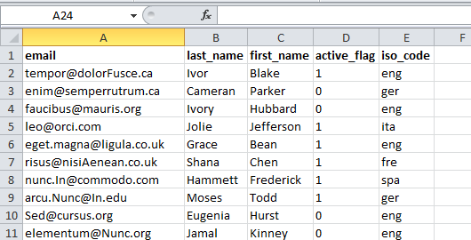
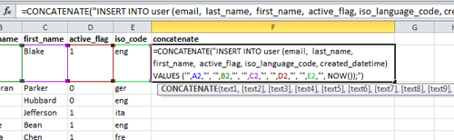
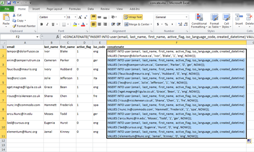

True, I'm most comfortable working with the front-end, but that doesn't stop me from writing SQL statements like a boss.

Like many applications, the ones I work with are largely database driven. And though we try to put as much of the data 
management into the hands of our project managers and client users when we're designing and developing our 
webapps—allowing them to easily manage database data through friendly user interfaces—there are occassions when it just 
makes more sense to crack open the database and take care of business through a couple <code>INSERT</code> statements.

For instance, to gain access to most of our webapps, users are required to log into secure accounts. Again, we design 
our apps so that admin users have the ability to create other user accounts. But inevitably and for any number of 
reasons—time limitations, resource limitations, user unfamiliarity with applications, etc.—our development team will 
receive makeshift listings of user information with a request to add all of the users to a certain application. An 
example might look something like:

Now we <em>could</em> add each user to the application through the UI, one by one. But we <em>do</em> have access to 
the application's database and the power of 
<a href="http://en.wikipedia.org/wiki/SQL" target="_blank" rel="noopener">SQL</a> at our disposal. The only question is 
how to get the data we've been provided into a SQL-friendly format. This is where Microsoft Excel's 
<a href="https://support.microsoft.com/en-us/office/combine-text-from-two-or-more-cells-into-one-cell-81ba0946-ce78-42ed-b3c3-21340eb164a6" target="_blank" rel="noopener">concatenate function</a> 
comes in really handy.

As of Excel 2010 (version 14), the concatenate function can join up to 255 strings—plain text, numbers, cell
references—into one. Here is an example of what the concatenate function looks like in Excel:

Back to our example. We can imagine what a SQL <code>INSERT</code> statement for one entry in our example would look
like:

<pre class="rounded-4 mb-3"><code class="language-sql">INSERT INTO user (email,
				  last_name,
				  first_name,
				  active_flag,
				  iso_language_code,
				  created_datetime)
VALUES ('tempor@dolorFusce.ca',
		'Ivor',
		'Blake',
		'1',
		'eng',
		NOW());
</code></pre>

Phew! That's a lot of typing. Imagine having to type out 20, 50, 100 of these statements. That could take awhile. It's
time to put Excel to work for us. All we have to do is wrap this SQL <code>INSERT</code> statement with a concatenate
function in Excel, swap out the values (<code>'tempor@dolorFusce.ca'</code>) for cell references (<code>A1</code>) and
then use the fill handle to copy the formula for all of our other entries.

Our concatenate function in Excel looks like this:

<pre class="rounded-4 mb-3"><code class="language-bash">=CONCATENATE("INSERT INTO user (email,  last_name,  first_name,  active_flag, iso_language_code, created_datetime) VALUES ('",A2,"', '",B2,"', '",C2,"', '",D2,"', '",E2,"', NOW());")</code></pre>

After we copy the function to all of our other entries, our spreadsheet should now look like this:

Once we have all our statements written correctly, we can copy and paste them into a new SQL query and execute. All of
our new users will be added to our database and, with the help of Excel's concatenate function, writing all of our
<code>INSERT</code> statements took a matter of seconds, not minutes.

Think of all the different types of insert statements you write and how Excel may be able to help speed things up. Here
are a couple examples of others we've used recently:

<pre class="rounded-4 mb-3"><code class="language-bash">=CONCATENATE("INSERT INTO study_user (study_id, user_id) VALUES (1, ",A1,"), (2,",A1,"), (3,",A1,"), (4,",A1,");")</code></pre>

We use this <code>INSERT</code> statement to add one user to multiple projects. Here we save time by eliminating the
need to re-write the <code>user_id</code> for each mapping.

<pre class="rounded-4 mb-3"><code class="language-bash">=CONCATENATE("UPDATE user SET welcome_email_send_datetime = NOW() WHERE id = ",A1,";")</code></pre>

We use this <code>UPDATE</code> statement to set a datetime value to <code>NOW()</code> wherever the <code>id</code>
is found.

Note, other advantages of relying on Excel to inject data into our statements include limiting the possibility of human
errors due to typos and being able to quickly update a large number of statements by updating only a single variable, or
data in a single reference cell. Total win-win!

<h2>Troubleshooting</h2>

Okay, maybe it's more like a <a href="http://youtu.be/SUtL6IS7wcY?t=2m14s" target="_blank" rel="noopener">
win-win-loss-win</a>. It can be tricky trying to get the quotation marks and spacing correct. Especially if you're like
me—someone who doesn't write SQL statements on a daily basis. Remember, the items in a concatenate function must be
separated by commas; strings and spaces (as opposed to numbers and cell references) must be set off by quotation marks;
and the function should take the following form:

<pre class="rounded-4 mb-3"><code class="language-bash">=CONCATENATE(text1, [text2], [text3], ...)</code></pre>

Additionally, note that SQL statements also require comma delimitation between items and quotation marks around strings.
Here's a closer look at how the Excel formula should look when entering values into a concatenate function:

<pre class="rounded-4 mb-3"><code class="language-bash">... VALUES ('",A2,"', '",B2,"', ...)</code></pre>

The pattern for each value is as follows:

[SINGLE QUOTE][DOUBLE QUOTE][COMMA][CELL REFERENCE][COMMA][DOUBLE QUOTE][SINGLE QUOTE][COMMA][SPACE]

The double quotation marks mark the beginning and end of strings of text in the Excel formula and the single quotation
marks are those that wrap SQL values.

It takes a little getting used to. But it's definitely a time-saver once you get the hang of it. If you want to practice
with the examples listed in this post, you can
<a href="/assets/documents/concate.xlsx">download an example spreadsheet here</a>.

And remember, if you run into any errors while typing out your formula in Excel, start troubleshooting by
double-checking commas and quotation marks.