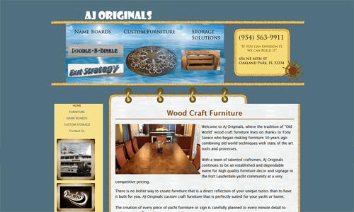
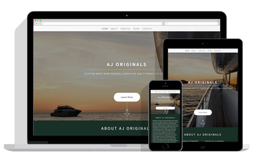
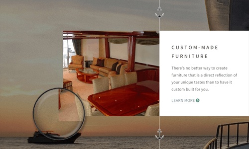
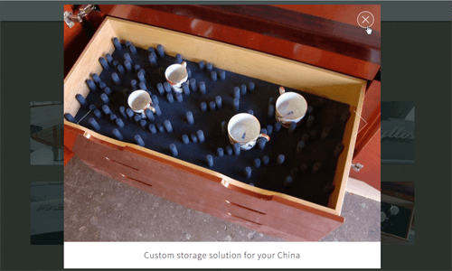

    

        AJ Originals is an established and dependable name for high quality furniture decor and signage in the Fort Lauderdale yacht community. Tony Surace, owner of AJ Originals, has been creating custom yacht furniture, name boards and storage solutions for over 30 years. Based out of Florida, AJ Originals' work can be found on yachts of all sizes&mdash;some, like Tiger Woods' old yacht <i>Privacy</i>, that are really prestigious&mdash;that travel all over the world.
    

    

        
        The problem AJ Originals is experiencing is that although its custom, hand-crafted work is of incomparable quality (It really is! I've seen it first hand.) and it's a well established and dependable name in the yacht community, its current website doesn't help extend that value proposition.
    

    

        The current site looks like a relic from the birth of the Internet. It lacks a cohesive, modern design. It's mostly unusable on mobile devices, and not otherwise optimized. It also carries very little SEO value. In the age of Internet marketing, where a company's web presence plays a large role in building the brand's value and business, the current AJ Originals site fails.
    

    

        I was asked to overhaul the site&mdash;give it a modern look, make it more user-friendly, have it work for the company as opposed to against it. I took all the good copy and imagery from the current site and re-worked it into a single page site that is both modern-looking and highly accessible. This was a fun weekend project done pro-bono.
    

     
    <h2>
        Responsive Design
    </h2>
    

        
        The page features responsive design in all of its elements, from how content is laid out to the sizes of images served to the plugins used to enhance the user's experience. For managing breakpoints and the grid system, I used a lightweight jQuery-powered framework called <a href="http://getskel.com/" target="_blank" title="View Skel site">Skel</a>.
    

    

        JavaScript was used for the header image, to resize it so that no matter what resolution screen was loading the site, the main image would fill the entire screen on initial page load. I also used CSS <code>columns</code> to break up text in certain places, and the <code>column-count</code> changes depending on viewport size. These are just two examples of many on the site where responsive design is applied.
    

     
    <h2>
        Parallax Scrolling
    </h2>
    

        One of the coolest parts of this site is how the background image moves in relation to foreground content as the user scrolls the page. It's a very subtle parallax effect. I think it gives the site a "yacht floating on the ocean" feel, with content floating over a beautiful background scene that is also constantly in motion.
        
    

    

        The parallax scrolling was designed to only work in certain situations, situations where it would not detract from the overall user experience. In some situations, like on smaller screen devices or browsers that don't handle parallax scrolling well, the feature degrades to a static image in the header and the rest of the page features a grainy, sandy-looking background.
    

     
    <h2>
        jQuery Plugins
    </h2>
    

        One of the other subtle page details is found in the navigation menu&mdash;as the user scrolls from one section of the page to the next, the styling of the menu items change to help the user keep track of where they are on the page. This feature is powered by a plugin called <a href="https://github.com/davist11/jQuery-One-Page-Nav" target="_blank" title="View One Page Nav on GitHub">One Page Nav</a>. It handles both the styling of the navigational elements as well as the smooth scrolling, and works equally well on small and large screen devices.
        
    

    

        I used another jQuery plugin called <a href="https://github.com/n33/jquery.poptrox" target="_blank" title="View Poptrox on GitHub">Poptrox</a> to display gallery images. As with the other jQuery plugins, Poptrox is super lightweight, easily customized and functions well in all browsers and on all screen sizes.
    

     
    <h2 id="outcome">
        Outcome
    </h2>
    

        Tony and team at AJ Originals were very impressed with the re-design. We're now in the process of collecting more product shots to better showcase all the wonderful work they do. We've also begun to expand AJ Originals' web presence via advertising with Google Adwords, social media networks and alternative domains.
    

    

        To learn more about how this site was designed and developed, <a href="http://www.chasewoodford.com/#contact">contact me</a>.
    

