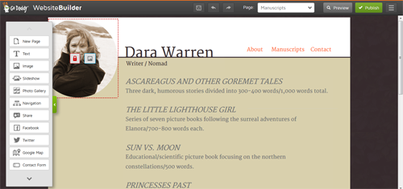
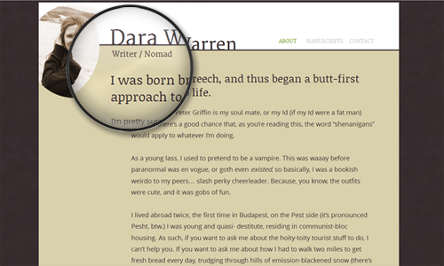
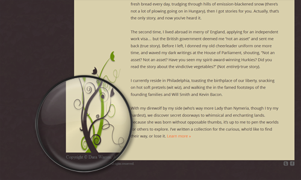

A friend of mine approached me for help building her website. She is a brilliant, creative person I got to know
initially through work. She recently went part-time so that she could devote more time to her work as an artist.
Specifically, writing. She writes children's and young-adult's literature.

She had begun shopping her writing around with agents and publishers and was receiving a lot of positive feedback. But
she noticed one thing that most of the authors she admired had that she didn't&mdash;a web presence.

There were times agents would ask how they could find her on the web or publishers could see more of her work and,
unfortunately, she could offer them nothing more than her e-mail address. So she called on me to help her create a site
where she could introduce herself and, most importantly, showcase her work. In her words, having a website made her "
feel like less of a phony".

Working on this project was extremely rewarding&mdash;learning about the ebb and flow of the publishing industry
vicariously through a good friend; learning how to make the biggest impact with minimal resources; seeing first hand how
website design affects client empowerment and confidence.

There is still a lot we want to do with this site and a lot we can do better, too. But our initial goal was just to get
her out there as quickly as possible and, as developments offline required, build on the site as needed.

<h4 class="mt-5 mb-3">GoDaddy Website Builder</h4>

The client had purchased a domain through GoDaddy. Specifically, GoDaddy's Website Builder Personal, a five-page website
deal. With the package you get no access to root files or template code, no FTP access, no database storage and no
hosting beyond the images you upload through the WYSIWYG (What You See Is What You Get, or 'wiz-ee-wig') editor. And
literally, what you see is what you get, or put another way, you get what you pay for. GoDaddy's website builder was
quite a challenge to work with.

As a designer, it is difficult to work with for several reasons. You're required to pick a template before adding
content to your site. Each template has unique features. But the problem is, the base template&mdash;the fonts, colors
and styles&mdash;is not directly editable. Some styles are editable using the WYSIWYG editor's built-in toolbars, but
options for customization are limited. Likewise, the drag-and-drop modules for forms, images, blocks of text, etc. also
allow for very little customization. For example, the contact form is the contact form; no adding or removing labels or
inputs without some serious CSS/JavaScript hacking. Pretty much every change to the template we wanted to make required
a ton of extra code to make happen. We ultimately ended up re-writing the template from top to bottom, and the limited
functionality of the website builder basically doubled the amount of time it took to design the site.

As a developer, the website builder is difficult to work with for several other reasons. Because we wanted to customize
the site, we had to build our own CSS file to overwrite all the template styles. However, the styles from our custom
stylesheet won't apply to the site until it is published. Meaning, we can't adjust our stylesheet and see changes
instantly, or even when in preview mode. Each time we made a change to the stylesheet we had to publish and re-load the
site outside of GoDaddy's website builder to see the changes in action. Having to do this a hundred times a day really
takes the wind out of the sails. Not to mention "hot-coding" like this is a really poor practice. Likewise, having the
site look one way inside the website builder and completely different outside means developing blindly, in a
guess-and-check fashion, which also really slows things down. The website builder, like most WYSIWYG editors, relies
heavily on absolute positioning. Also bad news. This means even the slightest change to content potentially throws off
the entire design. This also means you have to place elements in weird places in the WYSIWYG editor to account for
styles from your custom stylesheet that will later align the elements correctly once applied outside the website
builder. One of the other issues I found with GoDaddy's website builder was the automated mobile view, that could either
be enabled or disabled, but not customized and was only slightly editable. Meaning you have the choice of displaying
your page in either a poorly conceived, mistmatching design loosely optimized for mobile devices or as it would display
in a desktop browser with no optimization for mobile at all. We opted for the prior.

<h4 class="mt-5 mb-3">Web Fonts & Theming</h4>

The site features custom web fonts from <a target="_blank" href="http://www.google.com/fonts">Google Fonts</a>:
Merriweather and Noticia Text for headers, Open Sans for paragraph text and Strait for small text. The load on the page
is relatively small (847 B, ~110ms) and adds a kick of style to some otherwise plain, text-heavy pages. Additionally,
because the GoDaddy package we're working with doesn't allow file hosting, using Google-hosted fonts means we don't need
to worry about finding a home for our font files or accidentally breaking links to them in the future. The other nice
thing about Google fonts is that as usage of them grows, there's a higher chance visitors to our page already have the
fonts cached, further reducing the cost of loading them on our site. I'm a huge fan of using custom fonts to spice up
pages when paired appropriately and used tastefully. It especially made sense to use them in this case, where the
writing is really what we want to call attention to.

The look the client wanted for her site, in a word, was "enchanted". Her writing, even though it's targeted to the
younger reader, is a bit on the dark side, which is really what makes it interesting and what she wanted to convey with
her site. So we kept to a neutral, Earth-toned color scheme&mdash;text is brown, backgrounds are shades of brown and
white, links are shades of green and orange; the colors you might find walking through an enchanted forest.

There are a couple design elements consistent across all pages that also build on this enchanted theme. One is her
headshot. We took one that was more on the whimsical, candid side and muted the colors to match the site's color scheme.
This image manipulation serves several purposes: it lets the image fit in on the site from a design perspective; the
somewhat mysterious candid outdoors pose, with the wind-blown hair and big smile, acts as a reflection of her work; and
it doesn't distract the site's visitors from what we want them to focus on&mdash;the writing on the page. Another design
element found on all of the pages is the image of the vines rising up from the page footer. Again, the vines match the
site's color scheme. They have a mystical, fantasy-like look to them. And there's a slight drop shadow applied to them
to make them look like they are ever so slightly crawling off the page. The last design element is the background, which
is actually made of a repeated semi-transparent image of exotic leaves. The background image is barely noticeable, but a
small detail like this goes a long way in pulling the whole look and feel of the site together.
