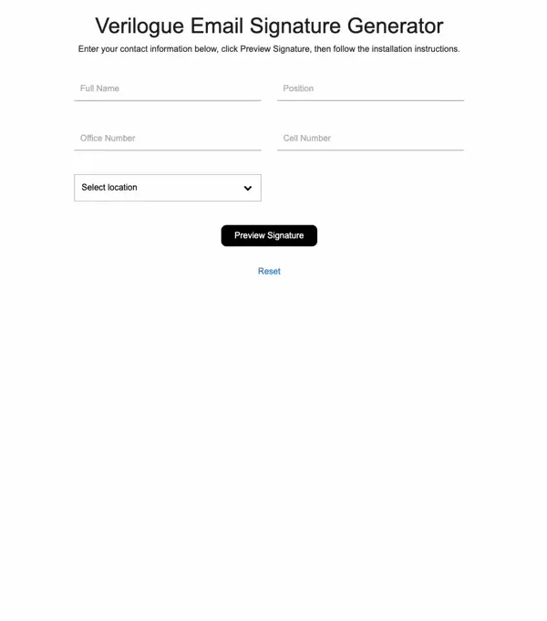
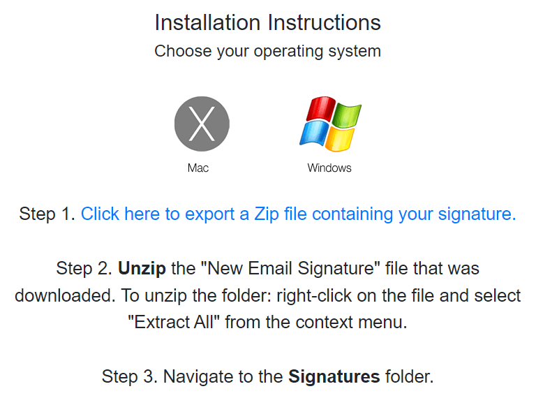

Creating a polished, professional email signature can often feel like a chore. Ensuring that an entire team maintains
consistent brand communication through email can be equally challenging. To address these issues for Verilogue, I
developed an Email Signature Generator. This user-friendly application, built with HTML, CSS, and JavaScript, simplifies
the process of creating and installing Microsoft Outlook email signatures, making it straightforward and enjoyable
regardless of the operating system.

<h4 class="mt-5 mb-3">Key Features</h4>

One of the standout features of my Email Signature Generator is the dynamic signature preview. Users enter their
information, click a preview button, and see how their email signature will look in context. To generate the preview, I
used JavaScript to take the input values and insert them into predefined HTML elements styled to look like they're in an
actual email. Form elements and the preview display are further enhanced with CSS animations to make them more enjoyable
to interact with and view.

Recognizing that users operate on various platforms, I included comprehensive installation instructions for both Mac and
Windows Outlook users. This feature ensures that no matter the OS, users have access to clear, step-by-step guidance on
how to install their new email signature. This aspect of the project involved technical writing and UI design to create
detailed and user-friendly installation guides.

Another notable feature of my Email Signature Generator is the implementation of the banner image. At the bottom of the
signature, there's an image sourced from an online file that our marketing team can overwrite to dynamically update the
image in everyone's emails. The image is wrapped in a link pointing to an endpoint that redirects to a location that 
the marketing team can change at any time. This setup, with an online source for the banner image and a
redirect for the link, allows us to update everyone's signatures simultaneously. This requires minimal effort from the
marketing team and no effort from anyone else.

<pre class="rounded-4 mb-3"><code class="language-html"></code></pre>

The trickiest feature of this project was actually generating an email signature that both Mac and Windows users could 
install in Outlook. For Mac users, it was a bit easier since Outlook for Mac has better support for copying and pasting 
HTML content into the Signature Editor interface. So for Mac users all I had to do was provide a link that when 
clicked copied the HTML content from the signature preview to their clipboard. Users were then instructed to paste this 
copied content directly into Outlook's Signature Editor interface.

<pre class="rounded-4 mb-3"><code class="language-javascript">$("#copy").on("click", function(e) {
    e.preventDefault();
    let range = document.createRange(), selection = window.getSelection();
    range.selectNodeContents(document.getElementById('prototype'));
    selection.removeAllRanges();
    selection.addRange(range);
    document.execCommand("copy");
    selection.removeAllRanges();
    $(this).html("Copied! 👍 <strong>Proceed to Step 2.</strong>").contents().unwrap();
});</code></pre>

For Windows users, I had to actually create an HTML file that they could save to their Microsoft Signatures folder since
copying/pasting HTML code into the Signature Editor interface in Outlook reformats all the underlying code. And because
of company download security policies, I first had to stick this HTML file into a ZIP file to ensure everyone in our
company was able to download the necessary file. To achieve this, I used the JSZip JavaScript library to create
a `signature.htm` file, stick it in a folder, and then zip the folder. Users were then instructed on how to unzip the 
file, locate their Microsoft Signatures folder, and transfer the downloaded file to the Signatures folder and confirm 
in Outlook that everything worked as expected.

<pre class="rounded-4 mb-3"><code class="language-javascript">$("#export").on("click", function(e) {
    e.preventDefault();
    let name = $("#fullname").val(), code = $("#code").text(), zip = new JSZip();
    zip.file("Verilogue Email Signature/signature.htm", $.trim(code.replace(/[\t\n]+/g,'')));
    zip.generateAsync({type:"blob"}).then(function(blob) {
        saveAs(blob, "New Email Signature (" + name + ").zip");
    });
    $(this).html("Files Exported! 👍 <strong>Proceed to Step 2.</strong>").contents().unwrap();
});</code></pre>

<h4 class="mt-5 mb-3">Conclusion</h4>

The Email Signature Generator has been well-received for its ease of use and effectiveness in creating professional
email signatures that maintain brand consistency across operating systems. It takes into consideration the differences
in email rendering between Mac and Windows, ensuring that signatures look great no matter the platform. This project
also showcases my ability to develop user-friendly applications with real-time feedback and robust functionality. Visit 
<a href="https://signature.verilogue.com/" target="_blank" rel="noopener noreferrer">https://signature.verilogue.com</a> 
to check out the app for yourself!