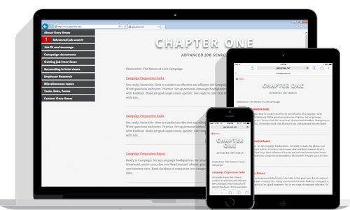
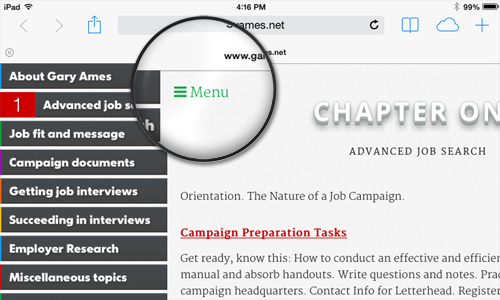
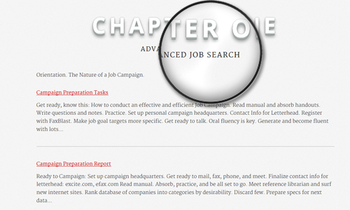

Gary Ames is currently Executive Director of Behavior Analysis & Therapy, a psychological consulting firm in Bala
Cynwyd, PA, USA, but in the past 30 years he has done everything from teaching to executive coaching. He has accumulated
a lot of knowledge in that time. Though he no longer practices executive coaching as a profession, he does like sharing
his previously acquired knowledge with acquaintances, and does this by directing them to his personal website.

Gary contacted me when he learned that his personal website, in addition to several other web properties he owned, no
longer functioned as originally designed.

The original goal of this project was to get his personal website working again, which was affected by technical issues
like broken links and unreachable databases, refresh some of the site's content, which had grown outdated, and give the
site's design an update while maintaining the familiarity of the layout and navigation.

Additionally, Gary desired a simplified, consolidated domain management experience. So, along with getting his personal
site working again and giving it a facelift, we decided to transfer all of his domain registrations and hosting services
to one provider and move the site's content from a propriety content management system to the more easily maintained and
user-friendly WordPress.

The project, originally estimated to take three or four months to complete, took nearly double that. But in the
end&mdash;after re-creating a corrupted database, nearly losing several domains due to registration expiration, battling
with hosting companies over lost login credentials and numerous other minor obstacles&mdash;the site was re-born with a
refreshed look and, most importantly, updated and accessible content.

<h4 class="mt-5 mb-3">Content Strategy</h4>

Gary's personal site has and continues to be structured in the form of a book. Each chapter focuses on one part of
executing a successful job search and contains several lessons, or posts, with each lesson building on top of the
knowledge gained from prior lessons.

The previous site design made it easy to jump from one piece of content to the next with its ever-present menu
navigation, however, it did not convey to the user this idea of a structured progression well.

In the re-design we made several enhancements to the site to help guide the user through the site's ideal flow. We gave
the site's menu navigation chapter numbers, an idea re-enforced by large headers found on every page; we made the
initial landing page for the site Chapter One's index page, as opposed to the About page; and we added smart buttons to
the bottom of each post to guide the user on to the next lesson.

<h4 class="mt-5 mb-3">Menu Navigation</h4>

The menu navigation boldly displays each chapter's name and on hover reveals the chapter's number with a smooth
transition created by a combination of <code>border</code> and <code>&#58;before</code> pseudo-element manipulation. 
The About and Contact list elements feature scalable vector icons from the 
<a href="http://fortawesome.github.io/Font-Awesome/" target="_blank">Font Awesome</a> toolkit. The menu is
positioned to always be visible on the top-left corner of the screen for devices with larger displays and designed to be
accessible only when needed on smaller screen displays, to help maintain the site's content hierarchy across all
devices. On smaller screen devices, clicking on the Menu hyperlink slides the menu navigation in from the left where
it's hidden off-screen until needed.

<h4 class="mt-5 mb-3">Chapter Numbers</h4>

On every page the first text seen is the chapter number. It, too, is bold in display, and uses a couple dozen layers
of <code>text-shadow</code> to achieve the 3-D look. These are not images, but fully accessible
text.

In WordPress, the chapter number is maintained through a custom field specified for each post. For the category pages,
because each chapter will contain only posts associated with one chapter, to get the chapter number to display on the
top of the page we wrote a simple query that finds the first post's custom field (the chapter number) and injects it
into the top of the page.

In addition to this query, there was a bunch of other logic required to make sure that category descriptions, post
descriptions and all the other metadata displayed correctly, making this site's code&mdash;the parts written in
PHP&mdash;quite
interesting. <a href="https://github.com/chasewoodford/garyames.net/blob/master/wp-content/themes/starkers-master/category.php" target="_blank">
See more on GitHub</a>.
