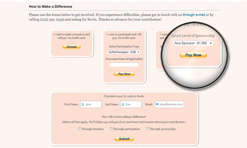
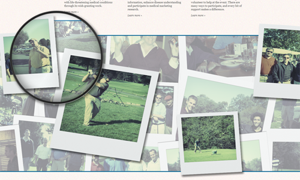
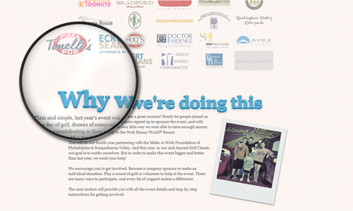
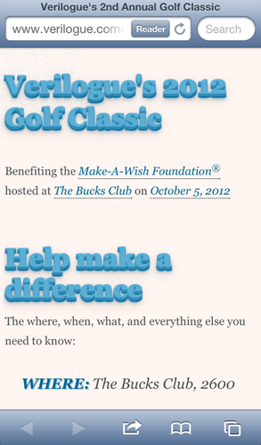

Verilogue's Golf Classic is an annual fundraising event that benefits the Make-A-Wish Foundation. In 2012, the event
helped raise over $8,000 for the cause. The event's website is the starting point for event registration and information
delivery to all participants and volunteers.

Not only did this project provide an opportunity to showcase the lighter, more playful side of a great company, it also
provided the opportunity to improve upon the user experience of the inaugural site. With a year's worth of user feedback
and data tracking under the belt, I was particularly excited to tackle this challenge. Having created the site for the
event's first year, too, I was aware of the issues both internal and external users experienced with that site, and was
determined to improve the experience in 2012, knowing it would lead to a higher conversion rate and less project
management.

<h4 class="mt-5 mb-3">PayPal Integration</h4>

Our number one goal for the 2012 event was to simplify the donation/registration process. In 2011, we tracked
registrations on a spreadsheet and accepted payment by cash or check only. Though we did a great job managing the
process, it was overly time-consuming, hardly scalable and not the ideal experience for our users.

So in 2012 we opted to integrate PayPal. The brand is relatively well known, secure and hassle-free. They have an
easy-to-use and well documented API, the transactional fees they charge are low and their terms/policies are pretty
straight forward.

We added several PayPal buttons to the site to allow users to make donations, register and pay to participate and sign
up to be a sponsor of the event. We also made available a generic, non-PayPal registration form for those users who
preferred to pay via cash or check; made a PayPal looking button for the form to keep the look consistent.

Another significant improvement made to the registration process on the back end was our integration of Marketo, an
automated marketing solution. Instead of tracking participants' activity on a spreadsheet, we added users to a mailing
list using Marketo's API. No more manual tracking of registrations and payments. In 2012 we knew who signed up for what
and could easily tailor custom messages to a more targeted group of participants.

As is the case with any good design, these improvements went mostly unnoticed by the event's participants. But that
ultimately was the goal.

<h4 class="mt-5 mb-3">Parallax Scrolling</h4>

Another goal of the site was to show visitors who may not have participated in the first year's event what to expect
using images taken from the prior year. To accomplish this, the site made use of a parallax scrolling effect, or the
movement of layered images at different speeds. We had hundreds of pictures of the first year's participants golfing,
winning prizes and having a great time. We wanted to display as many of these as possible without taking up too much
real estate. The parallax scrolling effect not only allowed us to showcase all the fun of the previous year's event, but
it also just looked cool and was a great way to break up content on the site.

<h4 class="mt-5 mb-3">CSS Text-Shadows, Transitions and More</h4>

In addition to the parallax scrolling effect, the site was sprinkled with other cutting-edge CSS effects. The sponsor
images had an <code>opacity</code> effect applied to them, where on hover they would "come to life"
in full color. The site's section titles used several layers of <code>text-shadow</code> to make
the words look like they were jumping off the page. Some images were treated with a <code>
transform: rotate()</code> effect to give them a loosely-scattered-on-the-page look. And all the links and critical
text information was treated with a smooth <code>transition</code> effect, where background and
font colors would change and text would move or become highlighted on hover. These additions, though not critical to the
overall design, did add to the enhanced experience for users who visited the site using modern browsers.

<h4 class="mt-5 mb-3">Adaptive Web Design</h4>

From analysis of the first year's site activity, we knew there would not be much traffic from devices other than
desktops. Of course, a year had passed, and users' behavior patterns had changed as quickly as the devices they used.
Even if tablets and mobile devices did not account for a significant amount of traffic, there were key interactions made
on these devices we had to prepare for, which is why we decided to make the site adaptive.

The most critical interaction occurred the day of the event&mdash;participants needed to make it there. Many used their
mobile devices to check on last minute details like location and time information. Others wanted to make last minute
donations. Others still wanted to share the event with their social networks.

So in our adaptive design the site was stripped down to critical text, links and forms. Tapping location links on a
smartphone gave users quick access to directions via map apps. Tapping e-mail addresses provided quick access to event
admins for immediate help. And integrated share buttons allowed users to update their social network statuses on the go.
The mobile-optimized version of the site was built using <code>@media</code> queries that adjusted
the fluid desktop layout to look good on small-screen devices while increasing the site's speed and performance, as
well.
