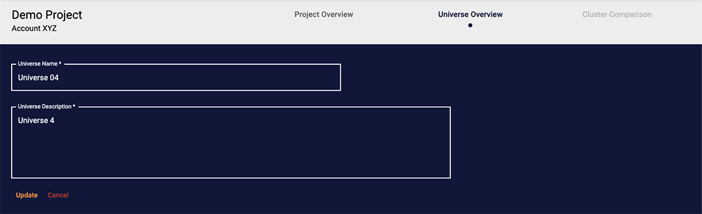

In 2023, <a href="https://publicishealth.com/news/publicis-health-launches-insagic-a-groundbreaking-insights-and-advisory-business" title="Publicis Health Press Release">
when Verilogue merged with ARIS to form Insagic</a>, we inherited development of an application called
<a href="https://publicishealth.com/healthstyles" title="HealthStyles website">HealthStyles</a>. It's a tool our data
scientists use to derive insights, made up of millions of healthcare, lifestyle, and consumer data points sourced by
various backend databases.

In its simplest form, the app is a frontend that allows a user to set parameters to define a "universe", or a sampling
of data points, from which "clusters", or data segments, can be created; clusters can then be compared and analyzed
further.

It's a React app supported by <a href="https://mui.com/" title="MUI website">MUI</a> on the frontend and uses an API to
interact with backend databases, some of which contain years of data, thousands if not millions of rows. Most of the 
app's technology runs on Amazon Web Services (AWS): API Gateway, Lambda, Glue, Redshift, EC2, etc. It features search 
functionality, data export capability, and saves configurations for universes and clusters.

<h4 class="mt-5 mb-3">Challenges</h4>

Upon inheriting the app, our goal was to enhance accessibility. Initially restricted to specific VPNs and IPs for
authentication, we aimed to integrate a single sign-on service. This shift not only expanded user access but also 
relieved us from some user maintenance duties.

Ensuring the app's widespread availability posed challenges beyond SSO integration. A significant overhaul of the UI/UX 
was necessary to create a more user-friendly experience, particularly for those who aren't data scientists. The app also 
had a few lingering bugs and hadn't yet been properly pressure tested. My primary contributions to the app's development 
involved enhancing the UI/UX, resolving bugs, and QA.

<h4 class="mt-5 mb-3">UI/UX Enhancements</h4>

As I began learning the codebase, my first couple commits included simple UI improvements. The app bar's drop shadow was
being clipped in certain situations due to positioning and z-index issues, so I fixed that. Clicking on the logo, a
universal "take me home" interaction, was still linked to the Material UI Getting Started docs, so I fixed that. The
buttons and links throughout the app did not look or behave consistently, so I fixed those. The layout also wasn't fully
responsive, so I reworked the grid and footer and removed max width restrictions so the layout made better use of all
available screen space.

Next I turned my attention to the <a href="https://mui.com/x/react-data-grid/" title="MUI X Data Grid docs">MUI X Data
Grid</a> tables. I updated them for a consistent look across the app. I also disabled the default row selection
functionality and messaging, which was confusing since there was nothing you could do with a row after you selected it.

There was also a feature in the table options that would allow a user to show and hide columns that needed adjusting. By
default, the user had the ability to hide all columns and then was left with no way to get the columns to show again. I
resolved this issue by disabling the user's ability to hide the Project Name column, ensuring the options menu on at 
least one column would always be accessible.

Lastly, I updated the Universes table on the Project Overview page. I added a Data Source column so the user could tell
which data source the universe was created from without having to click into the universe itself. I also improved the
display logic of the Universe Size and Percent Patients columns to display "TBD" if calculations hadn't completed yet as
opposed to displaying "0", which was misleading.

I also updated the Universe Overview page, adding Data Source and Patient Count displays to the universe header, the
ability to edit the universe name and description, and fixing the Edit Universe button state management to prevent
editing a universe that was actively undergoing processing, an action that would cause downstream issues.

One small, but significant UX improvement we made was changing the default setting of logical operators in the query
building process. Initially, the default was set to "or," but usability testing revealed that most users expected an "and" 
behavior. When users added multiple dimensions to a group, they assumed that all those dimensions would be present
in the results, limiting the outcomes. However, the "or" operator did the opposite of their expectations, causing
inefficiency and extra work. Users often realized this issue only after reviewing results, which took a considerable 
amount of time to generate.

By simply switching the default operator to "and," we significantly reduced the cognitive load on users by matching 
their expectations and minimized the occurrence of unexpected results.

One of the last enhancements we had to make to the app before making it generally available was a requirement from our
legal team: we had to link to an Acceptable Use Policy and prompt users to review it when they first logged 
in. I built a component that would query a user's activity and, if they had no previous activity, would display a 
prompt asking them to review the policy before proceeding to use the app. I also added a link to the document in the 
footer, so it could be viewed at any time.

I took this opportunity to also add prompts throughout the app to prevent accidental deletion or overwriting of data.
Previously, such actions occurred without warning on certain button clicks, which could lead to frustration and extra 
work. Now, confirmation prompts appear before any data deletion or overwrite, giving users the chance to cancel and 
avoid costly mistakes. 

<h4 class="mt-5 mb-3">Bug Fixes</h4>

As new features were added to the app over time, bugs and unexpected behavior emerged. Due to a small user count, a
limited developer team, and available workarounds, prioritizing net new development took precedence over fixing existing
issues. However, as we geared up for a release to a larger user base, we set a goal to ensure everything operated
optimally.

The first thing I focused on was fixing the state management on the Universe Overview page.

The universe and cluster creation processes are separate three-step processes with similar steps involved: generation,
calculating aggregates, and finalizing data exports. Different functionality is available depending on what state each
of these processes is in, with clustering possible only after a universe has been successfully created. Process progress
is displayed in the app using a Stepper component along with visual clues provided by link and button states.

Originally, the stepper's state was updated after logic split a string of words (e.g. "universe_end_aggregate_end")
pulled from a text file stored on S3 generated by an ETL process. Over time, as the process became more complex and the
status text changed, the logic used to inform the stepper component began to fail, resulting in incorrect status
displays and button states. Users might see the status as still in progress when it had actually failed or completed, or
download buttons enabled when there was actually no data available to export; if failure messaging was displayed, it was
too vague to know why something had actually failed.

I worked with the data architect to begin resolving these issues. We started by replacing the text string status with
separate response objects for each process. Each response included a generation status, an aggregation status, and
optional message. We also used constant values for statuses: BEGIN, END, FAIL. The response object would look something
like this:

<pre class="rounded-4 mb-3"><code class="language-javascript">{"clusteringStatus":"END","aggregateStatus":"BEGIN","message":null}</code></pre>

These changes allowed the app the track each process' status independently, so if one process succeeded but another
process failed it wouldn't look like the whole thing failed. This also provided a predictable set of values for the app
to work with, so if a process name like "universe" changed to "universe_cohort" on the backend it wouldn't cause the
frontend to display incorrect information. Additionally, these changes allowed for more detailed communication from the
backend, such as informing the user if clustering failed due to a small population size rather than implying a system 
error.

Once the enhanced status response was in place, I rewrote the page's component logic to handle the stepper and button
states independently. I created a `setStepperValue` function whose only job was to control the stepper's state. Each
button was given its own state variable,
e.g.  `const [enableAddClustersBtn, setEnableAddClustersBtn] = useState(false);`, and its own function to handle setting
its logical value, e.g. `canAddClusters()`. With everything decoupled, we had complete control over the state of each
piece of the UI. As an added benefit, the HTML code readability increased significantly, with button logic changing from
something that originally looked like:

<pre class="rounded-4 mb-3"><code class="language-javascript">{create &&
filesReady && 
!clusterLoading && 
clusteringStatus && 
clusteringStatus.clusteringStatus !== STATUS_BEGIN && 
!(clusteringStatus.clusteringStatus === STATUS_END && 
	!clusteringStatus.aggregateStatus) && 
clusteringStatus.aggregateStatus !== STATUS_BEGIN && (...</code></pre>

To simply:

<pre class="rounded-4 mb-3"><code class="language-javascript">{enableAddClustersBtn (...</code></pre>

The last batch of fixes we had to make was to the cluster creation process. This process is a three-step process that
allows users to set parameters for clustering a universe's population into smaller segments.

On the frontend, the process includes a series of views with different inputs. On submit, a data object is created and
shipped to S3 where an ETL process on the backend picks up the data and processes the request.

The first issue I noticed is that not all the data from the inputs was making it to the backend ETL process, which
was causing it to fail. I tracked this back to an error in some if/else logic, where in one case data was being appended
to `data.parameters` and in another case appended to `data.parameters.genetic_algorithm.model`. This was an oversight in
the code that crept in as the process grew in complexity, but was easy to fix after being identified.

The second issue involved debugging the backend's ETL process failure due to receiving string values instead of numeric
ones when default values were changed on the frontend. This traced back to two root problems: missing change handlers
for inputs and setting values with `e.target.value`, always returning a string. I resolved this by adding change handlers
and state variables to all inputs and using `e.target.valueAsNumber` for numeric values and `e.target.value === 'true'` for
booleans. This not only fixed the ETL process but also ensured changes were consistently persisted during user
navigation through the process.

<h4 class="mt-5 mb-3">Conclusion</h4>

The HealthStyles Reporting Tool was a powerful piece of software to begin with. And from expanding access through
SSO integration to refining UI/UX elements for a more intuitive experience, each enhancement was a step
towards making complex data analysis more accessible to a wider audience.

Through iterative improvements, spanning only a couple sprint cycles, I not only refined the application's interface 
and contributed to making it more scalable and reliable, but also cultivated a heightened awareness of React design 
principles and interaction patterns.

Prior to this project, my experience with React was limited to "Essential Training" courses, a few demo projects, and
what I learned from reading the docs. This endeavor marked a significant milestone in my journey as a developer, serving
as my first real experience working with a feature-rich, enterprise-level React JS application.

As the HealthStyles Reporting Tool evolves alongside the newly formed Insagic, the lessons learned and successes 
achieved during this enhancement release provide a solid foundation for continuing to drive forward innovations and 
advancements in data analysis and application development.