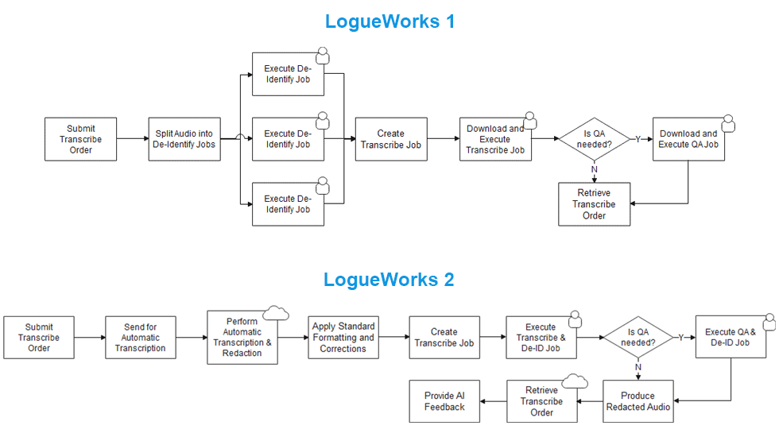
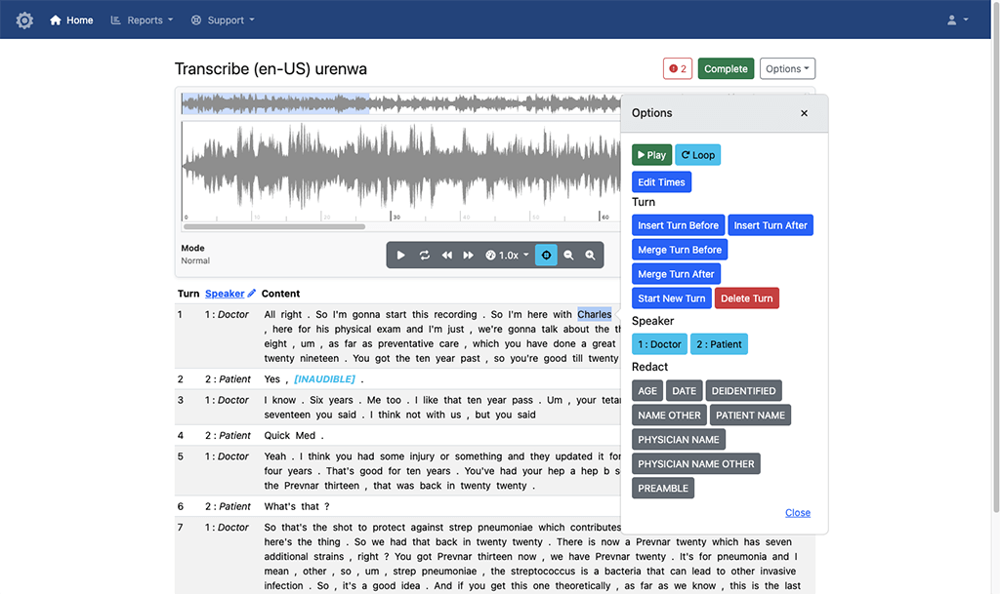
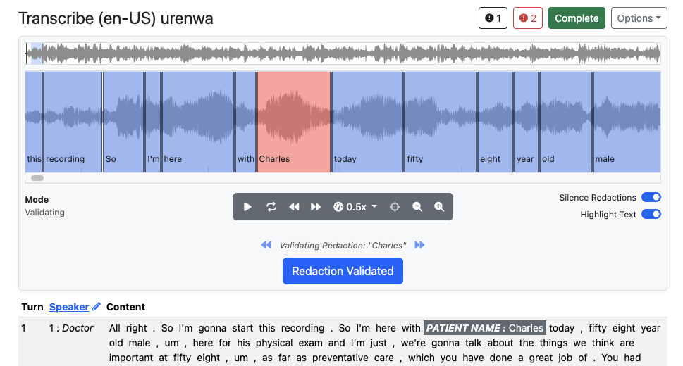
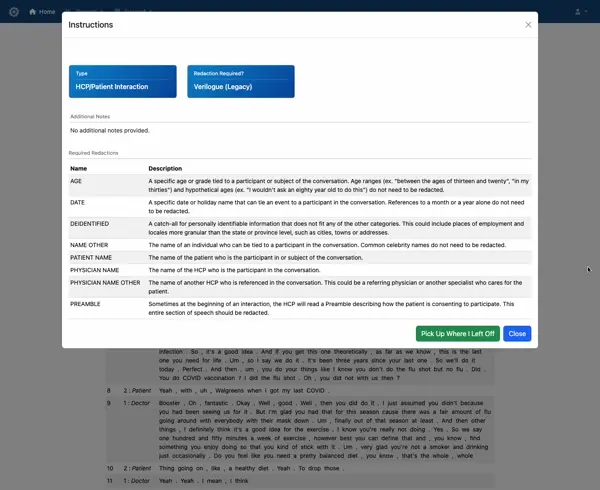
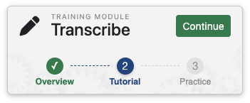
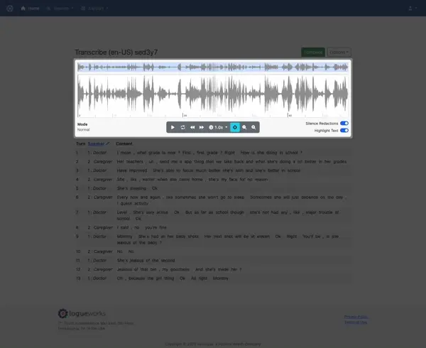
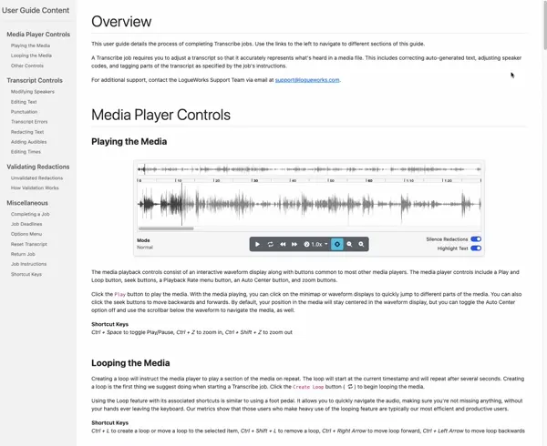
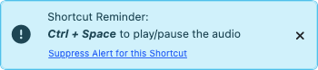
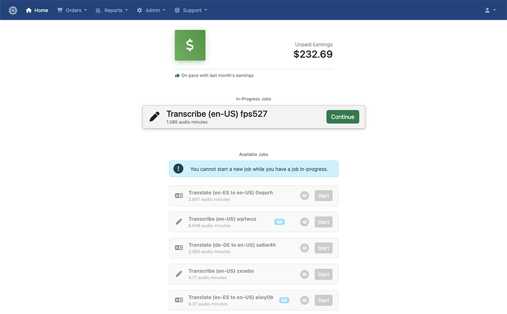
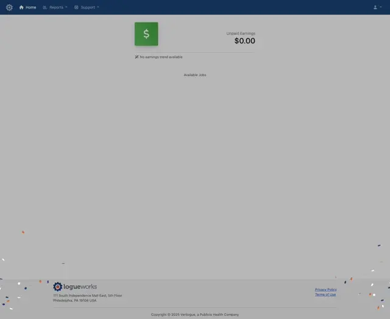

In the 5-10 years since Verilogue's transcription processing
platform <a href="/projects/logueworks/" title="Learn more about LogueWorks">LogueWorks</a> was first launched,
technology, business needs, and security concerns have all evolved. While we made ongoing updates to the original
LogueWorks to stay current, it became clear that a complete overhaul was necessary to maintain our leadership in the
field. Enter LogueWorks 2 (LW2), a new version marked by substantial improvements in efficiency, cost-effectiveness, and
security, driven by the integration of cutting-edge technology and user feedback.

TL;DR What is LogueWorks?

LogueWorks is Verilogue’s system for "turning dialogue into data". It provides various transcription services to Verilogue, our sister agencies, and our clients, including verbatim transcription, de-identification, and translation.

The work is completed by a combination of automated and manual tasks. The manual tasks are performed in a crowd-sourced manner by external vendor users from all over the world. Verilogue admin users manage the workforce and perform various quality assurance tasks to ensure the highest quality outputs.

From a technical perspective, LogueWorks consists of a web application, an application programming interface (API), and process artifacts that run on Amazon Web Services (AWS).

Key transformations include:

<ol>
    <li>AI Automation for Enhanced Workflows</li>
    <li>Heightened Security and Improved Analytics</li>
    <li>First-Class Onboarding and Training</li>
</ol>

These changes necessitated a complete reimagining of the platform's UI/UX. The following briefly summarizes our journey
from legacy LogueWorks to LW2, focusing on these key transformations.

<h4 class="mt-5 mb-3">AI Automation for Enhanced Workflows</h4>

Legacy LogueWorks initiated transcription from scratch for each job, whereas LW2 optimizes efficiency by utilizing
automated transcription services, such as AWS Transcribe, to provide an enhanced starting point. This transformation has
shifted the role of our transcription team from transcribers to editors, streamlining the process. A similar approach is
used for translation tasks. The introduction of a feedback loop further refines accuracy by automatically applying text
adjustments based on corrections users manually make to similar jobs. These innovations not only reduce workload and
enhance job completion efficiency but also improve overall transcript accuracy.

Improvements to our transcription process also facilitated significant improvements in our de-identification process,
our process of removing personally identifiable information (PII) from media and text. Unlike the labor-intensive
approach in legacy LogueWorks, where a team of users would have to download audio files and then use third-party
software to manually edit audio files, LW2 integrates de-identification seamlessly into the transcript editing process.
AI transcription and improved audio-to-text time alignment allow users to simply tag text, enabling automated redaction
of audio based on timestamped words.

Users can tag text via a custom-built context menu, which can be triggered in the traditional way, by a right-click on
the mouse, or by a shortcut key. When a user triggers the context menu display, a dynamic menu is displayed with options
appropriate to the currently selected item. The user can select an option from the context menu, which then updates the
transcript display, along with related underlying DOM data attributes, and initiates a database update.

In this way, when a user chooses to redact a portion of the audio, it's the data attributes for the time-aligned
redacted text that are passed to the media player to instruct it to mute the audio as the audio for redacted text is
played. On the backend, in a separate process that runs after the Transcribe job is completed, we pass all the redaction
timestamps along with the audio file to FFmpeg and instruct it to do all the actual audio editing programmatically.

For fine-grained adjustments of audio edits, we
use <a href="https://wavesurfer.xyz/" title="Learn more about Wavesurfer.js">Wavesurfer.js</a>
to display the waveform of the audio file and each redaction as a segment that users can move and resize as needed.
When a user has finished making adjustments, the changes to the redactions are saved in the form of updated timestamps,
which are resynced in the transcript interface and the database.

<h4 class="mt-5 mb-3">Heightened Security and Improved Analytics</h4>

Security has always been a primary concern for us in LogueWorks. One of the largest risks of legacy LogueWorks was the
fact that we allowed users to download and upload files. With LW2, we eliminated that risk, thanks to
improvements over the years in automated transcription and time-alignment technology. No longer do users need to
download files to complete their work efficiently.

This security enhancement required us to completely rethink the UI. It meant facilitating both audio and text editing
completely in-browser with the ability to switch between modes fluidly; implementing custom context menus and error
validation; "auto-saving" and "pick up where you left off" features.

We aimed to also enhance usability by minimizing the need for users to click buttons or remove their hands from the
keyboard during job completion. In our UI design, we prioritized shortcut keys, enabling users to seamlessly perform
various actions, from text adjustments (such as adding, editing, merging, and removing lines) to navigating through
audio and context menus, all with greater efficiency and minimal reliance on mouse clicks.

The UI overhaul also provided much more insight into what people were actually doing in LogueWorks. Before, we knew when
they would download and upload files, but not really what was happening beyond that. Now, after building in support for
editing entirely in-browser, we were able to track activity much more clearly. We now had data telling us which parts of
the process people were struggling with or were error-prone, where we weren't doing a good enough job educating people
on how to use the platform efficiently, etc. We knew that with a complete UI rework, we would have to do a lot of
untraining and retraining, and now we had the data to help guide us in doing it effectively.

<h4 class="mt-5 mb-3">First-Class Onboarding and Training</h4>

Onboarding new users in legacy LogueWorks was a major challenge due to the complexity of the work, a resource-intensive
manual process, and limited scalability, resulting in a less-than-ideal user experience. To address this in LW2, we
implemented a flexible onboarding framework designed to evolve over time. This
included creating new components and introducing just-in-time interactions to reinforce learning. These improvements
streamlined the process, removed bottlenecks, and minimized manual intervention, enabling new users to quickly achieve
high performance with greater efficiency.

We created a three-step onboarding process to guide new users from login through the start of their first job:

<ol>
    <li>Introduce users to a job-type specific workflow at a high level</li>
    <li>Walk users through the UI and process for completing a job of that type</li>
    <li>Test users comprehension of the training and provide immediate feedback</li>
</ol>

Progress against this onboarding training module is tracked on the user's dashboard.

The training is quick for experienced transcriptionists but detailed enough to ensure newcomers feel confident before
they start their first real job.

The first step introduces users to the workflow for a specific job type at a high level via images and text displayed in
a carousel.

The second step provides a walkthrough of the job-type specific UI. As opposed to showing the user a generic (and often
times outdated) version of the UI like we did in legacy LogueWorks, in LW2 we built in an interactive experience using
the <a href="https://introjs.com/" title="Learn more about Intro JS">Intro JS</a> JavaScript tour library.

This enables users to explore the UI at their own pace while guiding them to interact with it in key areas.
Additionally, this approach guarantees that users are always trained on the latest UI version while allowing us to
customize training to their specific tasks.

The third step requires users to complete a practice job. On completion of this job, we immediately compare the user's
work against a quality-assured, 100% accurate version of the job, and provide feedback on how they did. This process
ensures comprehension, reinforces muscle memory, and helps identify users who may not be fully engaged.

In LW2 we also decided to convert our style guide from a static document to an evergreen feature of the platform. This
enhancement provided a number of benefits:

<ol>
    <li>Improved accessibility: no longer is our style guide just a misplaced Word doc, it's an interactive resource available on-demand</li>
    <li>Consistent and up-to-date: as the app is updated, so is the style guide; no longer are there outdated versions of it floating around</li>
    <li>Easier to navigate: redesigned for readability with the addition of a nav menu to make finding the exact info needed simple and quick</li>
</ol>

Another key new feature in LW2 is shortcut keys. Users who frequently use shortcut keys are much more
efficient in their work; we have data to prove it. This is why we stress learning and using them during onboarding
training. We even track keystrokes and show reminders about them when we detect tasks that could be completed more
efficiently had shortcut keys been used.

Last but not least were improvements made to a user's dashboard. In legacy LogueWorks, users often struggled to
understand why work wasn’t available when they logged in, leading to confusion and support inquiries. To address this,
we enhanced the dashboard with a clearer visual hierarchy, better messaging, and a redesigned job card display that
includes more relevant details. Additionally, we introduced a job preview feature to further improve transparency and
reduce uncertainty.

We also leverage the dashboard to enhance user engagement with enjoyable and interactive experiences. For example, when
a user
completes a training module, they are rewarded with a celebratory confetti display, adding a touch of fun and positive
reinforcement to their learning journey.

<h4 class="mt-5 mb-3">Roadmap</h4>

Looking ahead, the LogueWorks 2 roadmap is focused on further streamlining workflows and enhancing the user experience
with cutting-edge technology. Key initiatives include automating the redaction process to improve efficiency, optimizing
the platform’s handling of large recordings and transcripts, and introducing a QA feedback and notes feature to
facilitate better collaboration and quality control. Alongside these core upgrades, we are committed to refining the UI
with clearer workflows, smarter automation, and seamless interactions that reduce friction and boost productivity.

These upcoming enhancements will ensure that LogueWorks 2 remains a powerful, adaptable, and future-proof solution. By
staying at the forefront of innovation, we are committed to delivering a best-in-class platform that empowers users to
work faster, smarter, and with greater confidence.
