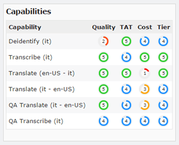
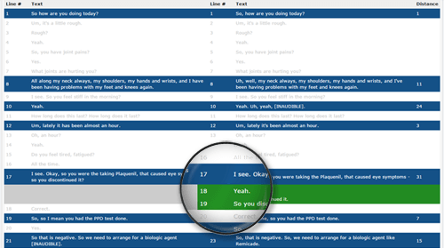

 

    

        LogueWorks is Verilogue's system of turning dialogue into data. In 2013, it began as a simple transcription application service provider. In only a few years, we've developed it into a full workflow management suite, capable of handling practically any transcription, translation or multimedia processing task imaginable.
    

    

        Borne out of the need for scalability, LogueWorks now services all of Verilogue's core transcription, translation and multimedia processing, as well as all orders submitted from other Verilogue-owned products, like <a href="http://www.verilogue.com/technology/revealmr" title="Learn more about RevealMR">RevealMR</a>. Additionally, LogueWorks services the needs of several <a href="http://www.publicishealthcare.com/en/network.aspx" title="View PHCG network">Publicis Health</a> sister agencies, and continues to expand its client roster beyond immediate Publicis Groupe family members.
    

    

        Under the hood, LogueWorks features some of the most radical technology ever programmed into a workflow management system. On the surface, however, it seems very simple:
    

    <ol>
        <li>Clients submit multimedia via a web interface or API call, along with parameters of the task(s) required of LogueWorks;</li>
        <li>LogueWorks creates an order and routes the jobs associated with the order to users;</li>
        <li>Once the jobs associated with an order are complete, LogueWorks packages up the order and ships back content to the client.</li>
    </ol>
    

        In addition to an API service and several back-end services that handle automated processing, the LogueWorks suite is made up of four separate web applications: a public-facing site, a secure Admin portal, Vendor portal and Client portal. These applications share a number of technologies.
    

    

        The LogueWorks team is made up of several hundred vendors located worldwide. Some are individuals, working part-time in the evenings or on weekends for supplemental income; some are traditional transcription/translation companies, completing hundreds of minutes of work every day. All are highly skilled and highly committed to their craft.
    

    

        Needless to say, every LogueWorks design decision has significant impact and requires meticulous consideration.
    

     
    <h2>
        Amazon Web Services
    </h2>
    

        With LogueWorks, we went all in with Amazon Web Services. We have EC2 instances running in multiple regions, globally distributed content via CloudFront, RDS MySQL databases, etc. Not only has going all in with AWS saved us a ton of money on operational costs, it also provided multiple extra layers of security, as well as high availability. AWS comes out with hundreds of new services a year, too, which means the technology powering LogueWorks will continue to be state-of-the-art.
    

     
    <h2>
         Google Charts & DataTables
    </h2>
    

        
        The data visualizations in LogueWorks are powered by <a href="https://developers.google.com/chart/" title="View Google Charts homepage">Google Charts</a>. Out of the box, they're beautifully designed. The interactivity of them adds a lot of value to the display. They're also highly customizable, easy to implement and have great cross-browser compatibility. Google also provides excellent documentation on how to use and customize Google Charts, which makes life as a developer that much easier.
    

    

        For table displays, we use <a href="https://www.datatables.net/" title="View DataTables homepage">DataTables</a>, a simple jQuery table plugin. Our experience using DataTables in other projects has always been really positive. Familiarity with the plugin made it an easy add to LogueWorks. It's also a lightweight plugin, easily customizable and highly flexible.
    

     
    <h2>
        Plucked Audio Editor
    </h2>
    

        
        Limiting the data that can be downloaded from LogueWorks is a top security priority of ours. Thus, allowing users to perform multimedia editing tasks without having to download data from LogueWorks is critical. However, building an in-browser audio editor was quite a challenging task, not only in terms of development, but also in terms of design. Only recently has the Web Audio API seen healthy support across browsers. When we were building the audio editor originally, our implementation options were limited. The <a href="https://github.com/plucked/html5-audio-editor" title="View Plucked HTML5 Audio Editor on GitHub">Plucked HTML5 Audio Editor</a> was one of few solutions we found that worked well in pressure tests. It uses only JavaScript and HTML, no extra plugins like Flash or Silverlight. Cross-browser functionality is not as crisp as we'd like&mdash;the homepage claims support by all major browsers except for Internet Explorer, but we've found support comes in varying degrees with each browser. The nice thing about Plucked is that since it's basically a JavaScript implementation of Audacity's C++ code, it's relatively easy to tweak and improve upon, which we had to do a lot of.
    

    

        Most people know how to use a media player, what a play button looks like, how to select things with a cursor, etc. But the challenge of designing the audio editor was that it was more than just a media player, requiring some of the unique functionality provided by the Plucked plugin, but also custom functionality we wrote in ourselves. The goal was to design the editor so that only the functions absolutely necessary to getting the job done were exposed to the LogueWorks user. We also had to design the editor so that the interface felt comfortable to those who were already familiar with other audio editing software, while at the same time was easy enough to use for someone being introduced to audio editing for the first time. All things considered, the LogueWorks in-browser audio editor has been a huge success.
    

     
    <h2>
        Public Site
    </h2>
    

        The public-facing site is an adaptation of the <a href="http://themeisle.com/themes/zerif-lite/" title="View Zerif Responsive One Page Theme from ThemeIsle">Zerif Responsive One Page Theme</a>. Now, I'm not a huge fan of using templates, but we decided to use one for the public page for a couple reasons:
    

    <ul class="square">
        <li>There are higher priority issues to address; time better spent on other initiatives</li>
        <li>We are not actively driving traffic to the page</li>
        <li>It's main purpose is to aid vendor recruitment communication efforts, most of which is done via e-mail</li>
        <li>It's not meant to sell LogueWorks as a service to clients</li>
        <li>We need a temporary landing page for the domain while content strategy/messaging is developed</li>
    </ul>
    

        The theme's code is very clean, making it really easy to work with. The page took less than a week to design, build and deploy. And we did work in a couple nice features&mdash;<a href="http://owlgraphic.com/owlcarousel/" title="View the Owl Carousel homepage">Owl Carousel</a> for rotating background images, <a href="http://fittextjs.com/" title="View the FitText homepage">FitText</a> for beautiful device-agnostic text rendering, and <a href="http://mynameismatthieu.com/WOW/" title="View the Wow.js homepage">Wow.js</a> for animating the content we wanted to draw visitors' attention to.
    

     
    <h2>
        Admin Dashboard
    </h2>
    

        The Admin portal is basically a huge data dump of all the LogueWorks client and vendor activity. The challenge with this part of application is making sure all critical data bubbles to the top while making even the deepest buried data easily retrievable.
    

    

        
        The Dashboard is divided into three sections: vendor activity on the left, client activity in the middle and action-required tasks on the right. Data visualizations are included to give an at-a-glance view into volume levels and trends. Notice all the links. You can click on just about anything and quickly dig deeper into specific data sets.
    

     
    <h2>
        Search Pages
    </h2>
    

        
        Search results and report displays are similarly designed. Links to dig deeper into the data. Everything is easily sortable via DataTables. And tons of filters are provided to make finding specific data easy to do.
    

    

        Note also the breadcrumbs at the top of the page, which come in extremely helpful when navigating deep into the data. These help users keep track of where they are and allow for easy navigation back through layers of data. Breadcrumbs are featured on all pages in LogueWorks, including on Vendor and Client portal pages, too.
    

     
    <h2>
        Tier Rank Design Element
    </h2>
    

        
        One of my favorite design elements is the Tier Rank display. Each user in LogueWorks is ranked in terms of quality of work, turn-around time and cost. LogueWorks uses these rankings to decide how to allocate jobs. The visual design of the ranking system consists of a color-coded circle with a number inside of it, created entirely using pure CSS. <a href="http://codepen.io/chasewoodford/pen/uBiIr" title="View the Tier Ranking design element on CodePen">Check it out on CodePen</a>. Tier Ranks are used all over the place, on both the Admin and Vendor portals, serving as constant reminders of the three tenets of LogueWorks: quality, speed and cost.
    

    

     
    <h2>
        Transcript Replacements
    </h2>
    

        Another great feature of LogueWorks is the automated transcript replacements process. This process runs on every submitted transcript, automatically checking for and correcting common typos, misspellings and formatting issues. All rules are powered by a regular expression engine built into the LogueWorks Admin portal. We also maintain a test suite for replacement rules, which we call Gold Standards. Additionally, we maintain multiple sets of rules&mdash;a global rule set that runs on all transcripts, as well as language-specific rules for each language supported in LogueWorks&mdash;and Gold Standard test suites for each rule set.
    

    

        
    

     
    <h2>
        Vendor Registration Process
    </h2>
    

        
        When a new vendor sign ups in LogueWorks, they work their way through a six-step registration flow. We designed each step of the registration process to have one focus. Each step is designed to be completed as simply and quickly as possible, given the amount of explanation required due to the fact that LogueWorks is rather dissimilar to most other transcription/translation portals users have experience with. All design elements featured in the registration flow were built with pure CSS, from the progress bar at the top of the page to the checkbox toggles found on form elements.
    

     
    <h2>
        Vendor Dashboard
    </h2>
    

        In stark juxtaposition to the Admin Dashboard, the Vendor Dashboard displays very little data. This is purposefully designed to enable users to complete tasks as quickly as possible, with little to no distraction. We provide a view into earnings to encourage continued productivity (via Google Charts), a section for critical messages, which is often empty, and a listing of jobs along with some metadata.
    

    

        
    

     
    <h2>
        Transcript Maintenance Interface
    </h2>
    

        The Transcript Maintenance Interface is powered by <a href="http://handsontable.com/" title="View the Handson Table homepage">Handson Table</a>, a data grid component with an Excel-like appearance. It may seem odd at first that we decided to use a data grid design for transcription work. Why not just use a vanilla in-browser text editor? In LogueWorks, we need to be able to parse transcripts line by line, and those lines need to match up between transcript versions for change tracking, audio-transcript time-alignment and translations. The spreadsheet-like design of Handson Table makes all of that easy to accomplish. We've also built in real-time error detection for common misspellings and unacceptable characters (the text and rows highlighted in red below), and customized the context menu, binding functionality unique to LogueWorks user needs. A lot of this added functionality would've been more difficult to implement using other in-browser text editing plugins. Plus, in LogueWorks we don't need all the fancy formatting functionality true text editor plugins feature. A consistent design goal for everything we do in LogueWorks is to make the complex as simple as possible.
    

    

        
        Users also have the option of creating transcript documents outside of LogueWorks in text editors like Microsoft Word, and can then upload documents to the system, which then parses content into the Transcript Maintenance Interface for continued editing.
    

    

        Note also on this page an example of the error messaging common throughout all LogueWorks portals (top of page), as well as the Notes feature (on the right) that provides our Quality Assurance (QA) team a means of communicating errors and issues back to typists.
    

     
    <h2>
        QA Reports
    </h2>
    

        
        Looking at an example QA Report, users can review notes left by the QA team as well as a side-by-side comparison of their work and the final, quality-assured transcript. This data available to both Admins and Vendors for each job, and each transcript version, saved in LogueWorks. The Transcript Diff Report borrows its design from diff report displays common to most programming software, with color-coded lines signifying changes (blue), additions (green) and deletions (red).
    

     
    <h2>
        Contract Slider
    </h2>
    

        Another fun design challenge was creating a slider Vendor users could use to adjust their rates in LogueWorks. The slider and the handle were both designed using only CSS. With a little bit of JavaScript, we bound the slider's position to the 'Recommend a rate for me!' button and also the input field below the button, so no matter what the user's preferred method of adjusting their rate is&mdash;via dragging the slider's handle around, clicking the button for a recommended rate, or inputting an exact rate in the input field&mdash;all data on the page adjusts in a synchronous fashion.
    

    

        
    

     
    <h2>
        Non-Responsive Design
    </h2>
    

        
        One final design decision worth noting is that LogueWorks is intentionally designed to be non-responsive in certain respects. In example, the Vendor Dashboard, when viewed on a smartphone, will show a little bit of information, but is for the most part unusable. We don't want users working in LogueWorks on devices where 100% of their focus is not on the task at hand and/or on devices incapable of running the technology required to complete tasks efficiently and successfully. To this end, we've strategically designed page layouts (table displays, button positions, etc.) in ways that make working from mobile devices virtually impossible. This design decision counters current device-agnostic web design trends, but we believe is critical to LogueWorks business goals and worth mentioning as it adds an extra layer of complexity to every design decision.
    

    

     
    <h2>
        Roadmap
    </h2>
    

        LogueWorks 1.0 was released in August 2013. In the 24 months between then and this writing, there's been 12 major releases, 23 minor releases and at least one project update released each month. For a team of three developers, that's a heck of a lot of designing, developing, testing and support.
    

    

        The LogueWorks roadmap is constantly in flux. It's influenced by not only client business needs, but also feedback provided by our Vendor users, which means there's no shortage in features to design and bugs to fix.
    

    

        Building LogueWorks has been one of the biggest challenges in my career, but also one of the most rewarding projects on which I've had the opportunity of working.
    

    

        I look forward to the continued design and development of LogueWorks, as well as all the new friends we'll make along the way.
    

    

        To learn more about how this web app was designed and developed, <a href="http://www.chasewoodford.com/#contact">contact me</a>.
    

