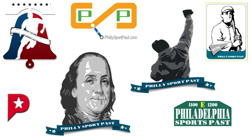
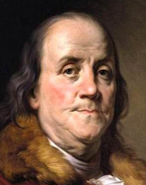
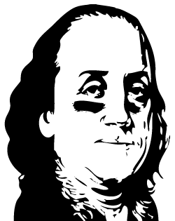

PhillySportPast is a website dedicated to breeding "4-for-4" Philly sports fans through education and interaction. The
website is backed by a huge database of Philly sports' events, trivia and factoids. It features links to nearly every
Philly sports figure and athlete, past and present, as well as interactive games and activities where users can score
points and battle other Philly sports fans for free prizes.

<h4>Ideation and Iteration</h4>

I was approached by the client&mdash;who already had an idea of what would make for a good mark for the PhillySportPast
brand&mdash;for help creating the company's logo.

The idea for the logo the client originally suggested was great&mdash;an image of Ben Franklin wearing
eye-black&mdash;and is ultimately what the final logo ended up being. But we wanted to go through a process of
exploration, regardless, for validation.

So I sat with the client in a brainstorming session where the challenge was proposed: here is my original idea, let's
see if we can think of something better. We put a bunch good ideas down on paper. I created draft versions of a couple
of those ideas in Photoshop. The client and I went back and forth over the course of a couple of weeks discussing what we
liked and didn't like about each concept.

It quickly became apparent during our process of design exploration that, more than anything, the PhillySportPast logo
had to do two things. One, it had to quickly connect the concepts of Philadelphia and sports. And two, it had to stand
on its own when the brand's name could not be included.

There were other considerations, too. The client wanted a logo that was color-agnostic, meaning the logo's colors could
change from one to another to match the team colors of whatever sport was in season. Likewise, the client also wanted
the font of the logo to have a Philadelphian feel to it. Lastly, the logo needed to be easily recognizable in a large
range of sizes, everything from a 16px icon to a 160px Facebook profile picture to a +30" print for merchandise, and as
mentioned above, this meant with and without the brand's name in text.

<h4>Vectorizing</h4>

Vectorizing is the process of converting a raster image into an image represented by vectors derived from mathematical
expressions. This allows for easy re-sizing of art without sacrifice of quality.

The PhillySportPast logo features a simplified and modified inverted relief vector image of Joseph Siffred Duplessis'
oil on canvas portrait of Benjamin Franklin from 1778.

    

    

A high resolution version of the painting was loaded into Adobe Illustrator and traced to create the foundation for the
logo. Once the parameters were adequately tweaked so that Franklin's most distinctive facial features were captured by
the trace, it was expanded and cleaned up, compound path by compound path.

The last bit to creating the PhillySportPast logo was to apply the eye black to Franklin's face. His facial expression
captured in the original portrait and, subsequently, the vectorized image made this a relatively easy task because the
paths for these strokes already existed in the form of facial wrinkles. Once I found a brush that looked most similar to
that of a greasy, oily smear, applying the eye black to Franklin's face was a simple matter of making brush strokes that
followed the already present contours of his face.
