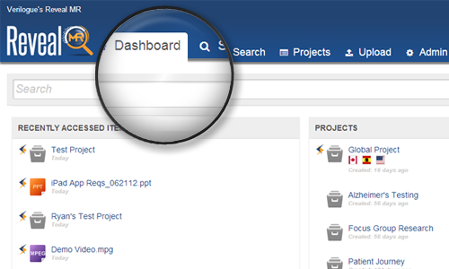
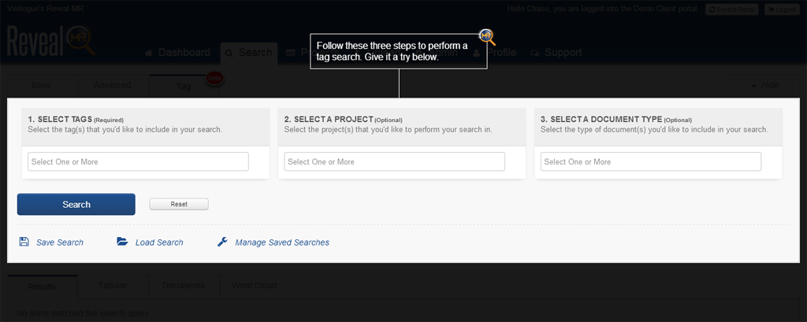
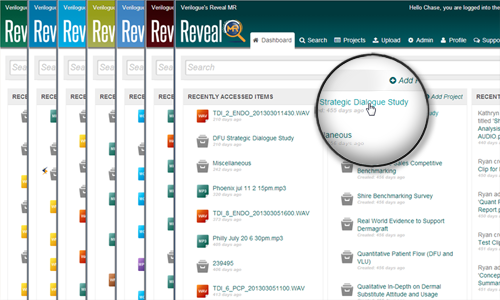
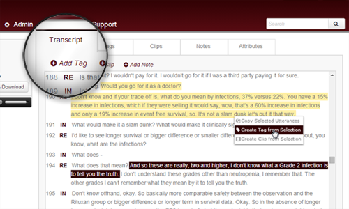

From Verilogue's website, <a href="http://verilogue.com/technology/revealmr" target="_blank">"RevealMR is a
cloud-based solution that maximizes your organization’s efficiency by revolutionizing the way you store, share, and mine
volumes of research data."</a> RevealMR dates back to 2008 and has undergone constant refinement since
then. (<a href="highlight-revealmr-001.png">Here's an example of what one of the
earliest versions of the platform looked like</a>.) In its current state, it leverages state-of-the-art technologies,
coupled with modern web design, providing an unparalleled turnkey platform for data
analysis. (<a href="/resources/video/reveal-onScreenExplainer.mp4">Watch a short introductory video and see Reveal
MR in action.</a>) It's a critical tool for dozens of pharmaceutical companies, advertising agencies and other
healthcare professionals, featuring not only incredibly powerful search capabilities, but also multimedia clip creation,
word cloud creation, multimedia transcription and time-alignment, document tagging, multi-language support, data
socialization&mdash;the list of features goes on and on. Building a web application as powerful as RevealMR
is no easy feat, and neither is designing all of its complex features and functionality in an intuitive and intelligent
way.

<h4 class="mt-5 mb-3">Bootstrap, Sass, jQuery</h4>

Reveal's front-end is built on the <a href="http://getbootstrap.com/2.3.2/" target="_blank">Bootstrap</a> framework. All
CSS is written in <a href="http://sass-lang.com/" target="_blank">Sass</a>. The platform also relies heavily on
the <a href="http://jquery.com/" target="_blank">jQuery</a> JavaScript library. Behind these three main components, we
also use:

<ul class="disc">
 	<li><a href="http://compass-style.org/" target="_blank">Compass</a> for more efficient Sass writing;</li>
 	<li><a href="https://github.com/stanlemon/jGrowl" target="_blank">jGrowl</a> for notifications;</li>
 	<li><a href="http://www.datatables.net/" target="_blank">DataTables</a> for advanced table displays and interaction;</li>
 	<li><a href="http://heelhook.github.io/chardin.js/" target="_blank">Chardin</a> for "just-in-time" education;</li>
 	<li><a href="http://harvesthq.github.io/chosen/" target="_blank">Chosen</a> for advanced form control;</li>
 	<li><a href="http://d3js.org/" target="_blank">D3</a> for enhanced data visualizations;</li>
 	<li><a href="http://flexpaper.devaldi.com/" target="_blank">FlexPaper</a> for rich and interactive document displays; and</li>
    <li><a href="http://www.jwplayer.com/" target="_blank">JW Player</a> for consistent cross-device media displays.</li>
</ul>

One of the biggest challenges of working on this project is acquiring a solid understanding of all the technology used
to build the platform. But this continues to be one of the biggest rewards of the project, too&mdash;having the
privilege of working with the newest technologies in a production environment, the experience of integrating them with
such a large web application and the reward of seeing enhanced performance and user experiences.

<h4 class="mt-5 mb-3">Responsive Design</h4>

It is important that the site functions fully not only on desktops, but also on smaller mobile devices, like tablets.
The challenge you run into when building such a capable web application, as opposed to a single-page website, is in the
integration of all the different components and plugins. When building a web application, responsive design requires
attention to more than just fluid layouts, media queries and smart asset loading&mdash;there's more performance
considerations, more DOM loading and manipulation considerations, more user experience considerations, more
accessibility considerations. Reveal features a design where everything&mdash;from the icons and text loaded on the
user's dashboard to the context menus displayed when the user interacts with a document&mdash;is designed with the goal
of achieving the best user experience possible, regardless of the device being used.

<h4 class="mt-5 mb-3">Progressive Enhancement</h4>

In addition to responsive design, Reveal was designed using the principle of progressive enhancement, or with a baseline
of usable functionality and increased richness of the user experience as support allows. The platform's baseline is
Internet Explorer 8 running on a wireless broadband Internet connection.

The platform functions properly on older browsers with slower connection speeds, but the difference between this
experience and the most enhanced experience is night and day. Some users miss out on all the modern CSS
enhancements&mdash;things like subtle shading, rounded corners and animations that are the small touches that really add
to the modern, fast, powerful feeling of the platform. Core functionality, like advanced searching, is available to
them, but they miss out on things like being able to generate word clouds from their data because the plugin used to
generate word clouds uses technology not support by their browser. Likewise, other features and displays are limited by
fault-tolerant design.

Unfortunately, a number of our users&mdash;residing mostly in the world of big pharma&mdash;are not using modern
browsers. Nor are they able to upgrade very easily due to company policies. The challenge in building a platform that
features state-of-the-art technology purchased by users limited to running the platform on significantly outdated
technology is obvious. The good news is that Reveal has been designed with this issue in mind and uses progressive
enhancement to provide each user with the best experience possible.

<h4 class="mt-5 mb-3">Icons</h4>

Reveal features complimentary use of icons throughout the platform. They appear next to navigational links, document
titles, on buttons and action items, and provide users with simple visual cues that make analyzing data easier.

Though Bootstrap comes with Glyphicons, we opted to
use <a href="http://fortawesome.github.io/Font-Awesome/" target="_blank">Font Awesome</a> as our icon font of choice
because the icon set better fit our needs.

Wherever document titles are found on the platform&mdash;on the user's dashboard, search results, on the document
details page itself&mdash;we compliment the text and metadata with file type icons to help users quickly recognize what
type of multimedia they're working with. For each file type supported by Reveal, there is an icon. There are dozens of
these icons. So instead of loading each image individual (talk about a lot of HTTP requests!), we created two image
sprites&mdash;one for small icons (32px), one for large icons (64px)&mdash;and use CSS to define the <code>
background-image</code>, or file type icon, that should appear.

Similar to file type icons, we also display flag icons throughout the site, which indicate the language/country
documents are associated with. Like our file type icons, there are dozens of different flag icons. But unlike the file
type icons, where we created image sprites to decrease the number of image requests made on each page, we opted to use
SVG images for the flag icons because having the image re-sizing flexibility was more important than limiting HTTP
requests. Beyond that, even in the short time between when we added file type icons and flag icons, which was maybe a
year, image spriting fell out of favor as the standard practice due to the rise of retina displays and the various sized
devices that required more flexible images&mdash;a requirement met most efficiently with SVG images.

<h4 class="mt-5 mb-3">Just-in-time Education</h4>

We use <a href="http://www.marketo.com/" target="_blank">Marketo</a> as our primary vehicle for keeping users informed
on platform updates. However, we realize not everyone reads these e-mails. Likewise, some features cannot adequately be
explained via e-mail. So we've implemented just-in-time education.

We decided to use just-in-time education, as opposed to feature tours, because research shows
that <a href="http://www.lukew.com/ff/entry.asp?1786" target="_blank">"most people (sometimes over 90%) skip over intro
tours as quickly as possible and those that don’t rarely remember what they were supposed to learn."</a> Using
just-in-time education provides us the opportunity to demonstrate how to use new features of the platform just before a
user is most likely to need them.

A good example of this is when we introduced a new form of search functionality&mdash;what we call Tag Search. The Tag
Search feature is kind of tucked away on a tab on the main search page. We mark the new feature's tab with a "beta"
badge&mdash;similar to a badge you'd find on the iPhone&mdash;to hopefully peak users' interest. Then, when a user
clicks on the tab for the first time, they are walked through using the new feature.

As opposed to doing a full features tour, where the entire system's features are explained at once, we display only the
instructions needed to complete micro-tasks when the user is most likely to need them. Likewise, breaking the
introduction of new features up in this way allows us to only display the instructions relevant to users who have access
to them. (Not all Reveal users get access to all new features.)

<h4 class="mt-5 mb-3">Theming</h4>

One of the other nice features of RevealMR is that we'll brand the site for clients. And when I say brand it
for them, we do more than just throw the client's logo on the site. (Note, all the screenshots on this page feature the
RevealMR logo in the header, but on a production site the client's logo typically fills this space. This
often involves some pre-processing, taking a raster version of the client's logo, vectorizing it and styling it to fit
the platform's design.)

For the most part, the theming process is database driven. For each client we set four attributes of a configuration
service: a primary color, a secondary color, a tertiary color and the location of the client's logo image. From there,
we inject these variables into a Java Server Page that contains a <code>style</code> tag. The theming JSP is then loaded
into the web application after the base CSS, allowing the rules containing client-specific styles to override base
styles.

Beyond loading a client's logo, a client's theme will also customize the gradients throughout the site, including
backgrounds and buttons, as well as hyperlink colors, text colors, selection colors, table row coloring, form controls,
like dropdown menus and focus states on inputs, icons, progress bars and borders.