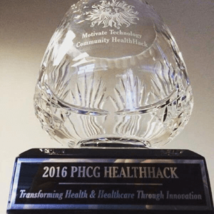
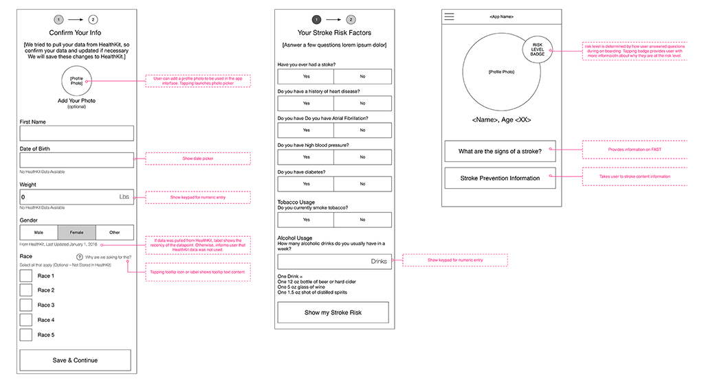
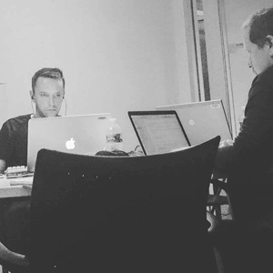
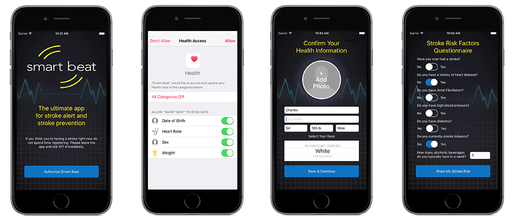
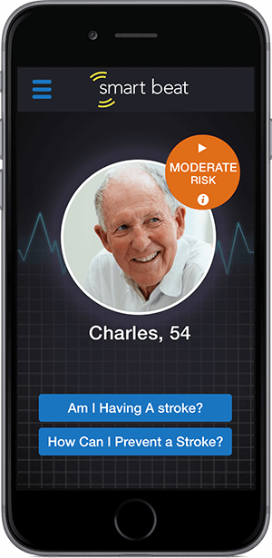

To start the new year, Publicis Health held its first ever hackathon. It was a two-day event that brought together
agencies from across the nation, including Discovery USA, Razorfish Health, InSync, ReSources, Maxcess, Verilogue and
Saatchi Health & Wellness, to collaborate on innovative projects that add value to PHCG or its clients, as well as build
relationships between agencies within the group.

More specifically, the hackathon challenge was to:

<figure class="bg-light p-3 rounded border">
    <blockquote class="blockquote fst-italic">
        

            "Develop an iOS app&mdash;preferably utilizing the Apple Healthkit&mdash;that creates a more positive patient experience 
            or helps to improve patient outcomes in some way. It can be around any condition, disease state or other 
            health and wellness related topic."
        

    </blockquote>
    <figcaption class="blockquote-footer mt-2 mb-0">
        <cite><a href="/resources/documents/PHCG_Health_Hack.pdf" target="_blank" rel="noopener noreferrer">PHCG Health Hack</a></cite>
    </figcaption>
</figure>

It was an amazing 24 hours of iOS hacking. The thing that impressed me the most was all the incredible talent within the
PHCG group, and how quickly and easily we were all able to come together and build some really cool stuff. I made a
bunch of new friends, learned a lot about Verilogue’s sister agencies and had a blast hacking the night away on our
Smart Beat app.

<h4 class="mt-5 mb-3">The Idea</h4>

We brainstormed
a <a href="/resources/documents/Health%20Hack%20Ideas.pdf" title="Idea brainstorm for HealthHack">
bunch of really great ideas</a> on a conference call a couple days prior to the event. But given the time limitations
for development, we opted for an idea that would create a more positive patient experience and improved patient outcome
specifically for stroke patients. We wanted to focus on a singular disease state and micro-interactions within that
patient journey that were critical to early detection of and quick recovery from ischemic strokes.

<h4 class="mt-5 mb-3">The App</h4>

On initial load, the user is walked through a profile configuration flow. During this flow, the user authorizes
HealthKit, and if data is available, it is used to help populate data fields for the profile set up. The user is then
asked to answer questions related to stroke risk factors.

After setting up a profile and answering risk factor questions, the user lands on the home screen view of the app, which
displays current stroke risk status along with links to mission-critical information. The home screen also has a menu
button on the top left of the screen that provides access to more app features.

<h4 class="mt-5 mb-3">HealthKit Integration</h4>

Our initial integration of HealthKit was very simple. We decided to only pull in existing date of birth, biological sex,
body mass and heart rate data. We use this data to assist in profile set up and stroke risk calculation. For any data
not already stored, we prompt the user for input and save it to the HealthKit store. The code for our HealthKit
integration can be found in
the <a href="https://github.com/chasewoodford/StrokeApp/blob/master/StrokeApp/HealthManager.swift" title="HealthManager.swift">
HealthManager.swift</a>
and <a href="https://github.com/chasewoodford/StrokeApp/blob/master/StrokeApp/OnboardTwoViewController.swift" title="OnboardTwoViewController.swift">
OnboardTwoViewController.swift</a> files.

<h4 class="mt-5 mb-3">// TODO</h4>

In the 24 hours we had to develop a working prototype, we were able to build out most of what we called the on-boarding
flow, most of the home screen view functionality and placeholders for most other views.

Still a lot to be done though. Future development would include:

<ul>
    <li>Real-time heart rate monitoring and notifications for risk status changes</li>
    <li>Integration of more HealthKit sample types for enhanced risk calculations</li>
    <li>Completion of F.A.S.T. screening module</li>
</ul>

We also had some really great ideas for setting baseline levels and tests a user can take to gauge disease progression
and recovery. We talked about using the iPhone camera as a means for measuring heart rate by placing a finger over the
lens; using the camera to take selfies and check for facial abnormalities; using voice recordings to detect slurred
speech; using the accelerometer to measure steadiness in the hands and ability to raise arms.

<h4 class="mt-5 mb-3">The Design</h4>

Our goal was to keep the design as simple as possible; use as many native iOS elements as possible, and really focus
design efforts on the home screen view.

We were fortunate to have two designers on our team, in addition to a copywriter and a UX specialist. One designer
focused on comping out the on-boarding flow and home screen while the other focused on designing the app’s logo, both
following the direction led by the wireframes built by the UX guy, integrating the copy provided by the copywriter.

The end result was a design that I thought was very aesthetically pleasing, simple and suitable for the likely
demographic of our user base.

<h4 class="mt-5 mb-3">Outcome</h4>

Unfortunately, Smart Beat didn’t win the competition. I still think it is a great idea and our execution of bringing it
to life was pretty solid. But we were up against a bunch of other really great ideas, too. Though our app met all
requirements of the hack, I think we fell a little short in our presentation of the idea. I imagine that’s the toughest
part of any hackathon&mdash;fully conveying complex ideas with only a partially functional prototype. Still, it was a
great experience that left me inspired and feeling lucky for the opportunity to work alongside such talented people.

In addition to being a great experience, we also learned that one of the judges has recently been discussing future
projects with a large pharmaceutical company, and their conversations revolved around tPA, the only FDA approved
treatment for ischemic strokes. We're hopeful that the next time they connect to discuss tPA, Smart Beat will also find
its way into the conversation. Even though we didn't win the hackathon, the idea may still have legs and someday see the
light of day.

<h4 class="mt-5 mb-3">Links</h4>

<ul>
    <li>Event Announcement: <a href="/resources/documents/PHCG_Health_Hack.pdf" title="PHCG HealthHack Announcement">PHCG HealthHack Announcement</a></li>
    <li>Idea Brainstorm: <a href="/resources/documents/Health%20Hack%20Ideas.pdf" title="HealthHack Idea Brainstorm">HealtHack Idea Brainstorm</a></li>
    <li>GitHub Repository: <a href="https://github.com/chasewoodford/StrokeApp" title="Smart Beat code on GitHub">https://github.com/chasewoodford/StrokeApp</a></li>
</ul>

<h4 class="mt-5 mb-3">Special Thanks</h4>

A very special thank you to all the people who made this event possible and my super talented teammates!

Judges:

<ul>
    <li><a href="https://www.linkedin.com/in/janet-winkler-b1a837a" title="Janet Winkler">Janet Winkler - Group President, Publicis Healthcare</a></li>
    <li><a href="https://www.linkedin.com/in/mhunter" title="Mark Hunter">Mark Hunter - EVP, Operations, Razorfish</a></li>
    <li><a href="https://www.linkedin.com/in/nikki-muntz-8b643a1b" title="Nikki Muntz">Nikki Muntz - EVP, Business Development, Publicis Healthcare</a></li>
</ul>

Coordinators:

<ul>
    <li><a href="https://www.linkedin.com/in/jeff-smith-18551a1" title="Jeff Smith">Jeff Smith - Global Head of Technology, Razorfish</a></li>
    <li><a href="https://www.linkedin.com/in/jamison-barnett-5280662" title="Jamison Barnett">Jamison Barnett - VP, Verilogue</a></li>
</ul>

Apple:

<ul>
    <li><a href="https://www.linkedin.com/in/drosos" title="Christos Drosos">Christos Drosos - Enterprise Technology Strategy, Apple Inc.</a></li>
</ul>

Team Smart Beat:

<ul>
    <li><a href="https://www.linkedin.com/in/keithhobin" title="Keith Hobin">Keith Hobin - Experience Architect, Razorfish</a></li>
    <li><a href="https://www.linkedin.com/in/kristenhumbert" title="Kristen Humber">Kristen Humbert - Copywriter, Razorfish</a></li>
    <li><a href="https://www.linkedin.com/in/shikhasharmapharmd" title="Shikha Sharma">Shikha Sharma - Account Director, Maxcess</a></li>
    <li><a href="https://www.linkedin.com/in/shaun-stuart-832b655" title="Shaun Stuart">Shaun Stuart - Senior Manager, Verilogue</a></li>
    <li><a href="https://www.linkedin.com/in/matt-sutter-7584441" title="Matt Sutter    ">Matt Sutter - Art Director, Razorfish</a></li>
    <li>Ian Torp - Senior Graphic Designer, Maxcess</li>
</ul>